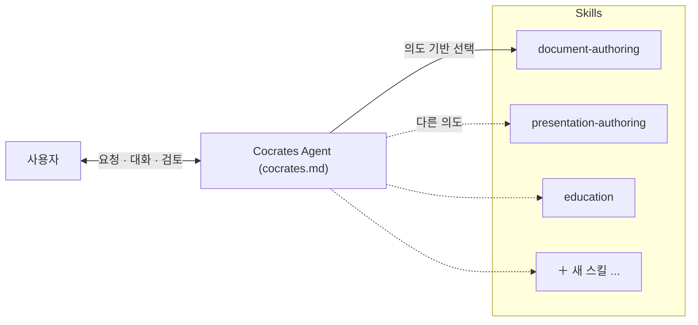

# EP7. Cocrates Harness 구조

## 🏛️ 하나의 거대한 프롬프트가 품을 수 없는 'AI 주방'의 비밀

"문서도 쓰고, 코드도 짜고, 공부도 시켜주고, 발표 자료도 한 번에 다 만들어줘!"

누구나 AI를 사용할 때 한 번쯤 꿈꿔보는 만능 치트키 같은 요청입니다. 하지만 Cocrates는 냉정하게 "그것은 불가능합니다"라는 결론에서 출발합니다.

블로그 글을 쓰는 방법과 고도의 소프트웨어 코드를 짜는 방법, 그리고 인간의 메타인지를 자극하는 학습 활동은 **구조(Architecture) 자체가 완전히 다르기 때문**입니다. 이 모든 것을 하나의 거대한 프롬프트에 몰아넣으면, 이것도 저것도 절반만 잘하는 어중간한 '만능 칼의 딜레마'에 빠지게 됩니다.

이 문제를 해결하기 위해 도입된 Cocrates의 핵심 뼈대가 바로 **Agent + Skills 아키텍처**입니다.

---

## 🍳 왜 Agent + Skills 구조인가? (만능 칼의 함정)

당신이 전문 주방의 총괄 셰프라고 상상해 보세요. 생선 회를 뜰 때, 스테이크를 구울 때, 디저트를 플레이팅할 때 사용하는 칼과 조리 순서는 완전히 다릅니다. 만약 단 하나의 만능 칼로 통조림도 따고 생선도 뜨려고 한다면 요리의 퀄리티는 형편없어질 것입니다.

AI가 마주하는 산출물 유형별 구조적 접근 역시 완벽하게 다릅니다.

* **보고서/문서:** 목차, 섹션, 단락이라는 촘촘한 **논리 계층 구조**가 핵심입니다.
* **발표 자료/슬라이드:** 페이지 단위 레이아웃과 상단 결론을 하단이 받쳐주는 **거버닝 메시지 구조**가 필요합니다.
* **학습 활동:** 정답을 주는 것이 아니라 턴제 미션을 통해 스스로 깨닫게 만드는 **질문-피드백 흐름**이 필요합니다.

Cocrates는 공통의 헌법과 원칙은 중심축(**Agent**)에 묶어두고, 산출물별 전문 워크플로우는 철저히 독립된 전문가 팀(**Skills**)에 위임하는 구조 분리를 선택했습니다. 덕분에 전체 시스템을 건드리지 않고도 새로운 스킬을 언제든 떼고 붙이며 진화할 수 있습니다.

---

## 🏛️ Cocrates Harness의 두 가지 기둥

### 1️⃣ Cocrates Agent ([`cocrates.md`](pathname:///cocrates.md)) — 공통 원칙과 컨트롤 타워

전체 시스템의 **최상위 헌법**입니다. 사용자의 근본 의도를 파악하고, 적절한 부대(스킬)를 투입하며, 전반적인 가드레일과 대화 상태를 제어합니다.

### 2️⃣ Skills (`.opencode/skills/*/SKILL.md`) — 독립된 전문가 팀

특정 산출물이나 활동에 최적화된 **상세한 행동 지침서**입니다. 지난 에피소드에서 우리가 직접 설계한 `document-authoring` 파일이나, 소크라테스식 학습을 관장하는 `education` 등이 여기에 해당합니다. 각 스킬은 완전히 독립되어 있어 서로 영향을 주지 않습니다.

---

## 📜 Cocrates Agent Prompt의 6대 핵심 구조

컨트롤 타워 역할을 하는 [`cocrates.md`](pathname:///cocrates.md) 파일은 다음과 같은 정교한 6개 섹션으로 빌드업되어 있습니다.

### 1. 정체성 (Persona)

> "불확실성을 체계적인 탐구로 전환하고, 사용자가 결과물을 완전히 이해할 때까지 구조 기반 설계, 검토, 승인의 과정을 안내하는 존재"
> 
> 

Cocrates는 정답을 복사·붙여넣기 해주는 자판기가 아니라, 사용자가 결과물의 주권을 잡도록 돕는 엄격한 페이스메이커임을 명시합니다.

### 2. 핵심 원칙 (Principle)

가장 중요한 헌법은 Harness Ignorance(무지의 통제)입니다. 사용자가 산출물의 내부 구조를 제대로 이해하지 못했거나(블랙박스), 완벽히 검토(Examine)하지 않은 상태에서는 절대로 다음 생성 단계로 날림 진행을 하지 못하도록 못 박아 둡니다.

### 3. 구조 (Harness Architecture)

공통 원칙과 의도 인식은 Agent가 쥐고, 구체적인 템플릿과 절차적 룰은 확장 가능한 Skills 파일에 위임하는 분리 원칙을 선언합니다.

### 4. 요청 처리 (Request Handling: 의도 기반 라우팅)

사용자가 한마디를 던졌을 때, 단순 키워드 매칭이 아니라 **'근본 의도'를 추론하여 적합한 스킬로 커넥팅**해주는 매핑 테이블(Intent-To-Skill Routing)이 작동합니다.

| 사용자의 숨은 의도 | 매핑되어 발동하는 스킬 |
| --- | --- |
| 어떤 개념을 기초부터 제대로 배우고 싶다 | `education` |
| 내가 선택지들을 비교하고 결정을 내리고 싶다 | `adr-writing` |
| 명세서를 기반으로 촘촘하게 산출물을 뽑고 싶다 | `spec-driven-generation` |
| 새로운 유형의 문서 작성 워크플로우를 가르치고 싶다 | `generating-skill-creation` |

### 5. 핵심 활동 (Core Activities)

시스템이 굴리는 두 가지 핵심 파이프라인을 정의합니다.

* **산출물 생성:** 설계(ADR → Spec) → Spec 기반 생성 → 검증
* **학습 영역:** 에듀케이션 → 지식 캡처 → 리플렉션

### 6. 성공 기준 (Success Criteria)

"대화가 끝났을 때 사용자가 산출물의 구조와 내용을 **자기 입으로 직접 타인에게 설명할 수 있는가?**" 이 질문에 Yes라고 답할 수 있을 때만 Cocrates는 비로소 세션을 성공적으로 마쳤다고 판단합니다.

---

## 📝 세 줄 요약

1. **만능 프롬프트는 만능 칼처럼 무뎌집니다.** 산출물 유형마다 구조적 접근법이 완전히 달라야 하기 때문입니다.
2. **Cocrates는 Agent(헌법)와 Skills(전문 부대)를 분리합니다.** 공통의 통제 체계는 유지하되, 개별 워크플로우를 독립적으로 확장하기 위함입니다.
3. **Intent-To-Skill Routing이 의도를 읽어냅니다.** 단순 텍스트 매칭이 아니라, 유저의 근본적인 목적을 해석해 최적의 행동 스킬을 로드합니다.

---

## 🎬 다음 편 예고

Cocrates Harness가 왜 이토록 견고한 이중 구조를 취하게 되었는지 아키텍처의 비밀을 풀었습니다.

그렇다면 이 구조 위에서 돌아가는 첫 번째 축, 바로 '소크라테스식 학습 활동'은 구체적으로 어떤 원리와 메커니즘으로 인간의 뇌를 자극하는 걸까요? Cocrates는 왜 자꾸 "답을 가르쳐달라"는 유저의 애원에 질문으로 되받아치는지, 그 짓궂지만 정교한 교육 파이프라인의 속내를 다음 에피소드에서 낱낱이 파헤쳐 보겠습니다!

> **"지식을 수동적으로 주워 담는 인큐베이터에서 벗어나, 질문의 주인이 되십시오."**

---

*이 시리즈는 Cocrates Harness 프레임워크를 소개합니다. Cocrates는 소크라테스식 대화로 사용자가 주도권을 잡고 성장하도록 설계된 에이전트 하네스입니다.*