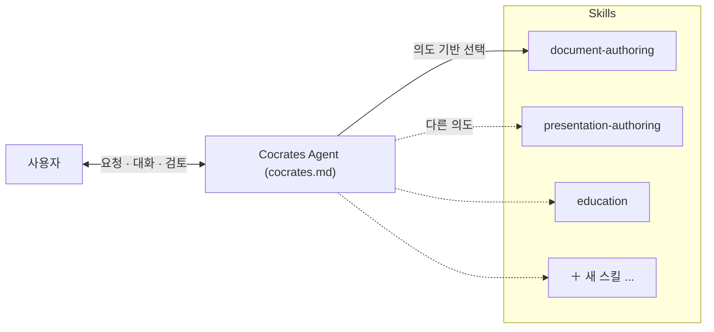

# Cocrates Harness 구조

---

지난 세 편(Ep4~Ep6)에서 우리는 Cocrates를 활용한 세 가지 실습을 진행했습니다.

- **학습(Ep4)**: Bloom's Taxonomy를 Cocrates의 Education → Knowledge Capture → Reflection 파이프라인으로 배웠습니다.
- **구조 기반 소프트웨어 생성(Ep5)**: jsondb를 개발하며 ADR → Spec → Generation → Verification의 전 과정을 경험했습니다.
- **보고서 작성 스킬 생성(Ep6)**: `document-authoring` 스킬을 직접 설계하고 생성했습니다.

이 실습들을 통해 Cocrates가 어떻게 우리의 역량을 높이고 AI를 올바르게 사용하도록 돕는지 직접 체감했을 것입니다. 이것이 Cocrates Harness의 핵심 가치입니다.

> **"The unexamined code is not worth generating."** — 검토되지 않은 산출물은 생성할 가치가 없습니다. 그리고 이 원칙을 가능하게 하는 것이 바로 **Cocrates Harness**입니다.

하지만 Cocrates Harness도 최종 완성품이 아닙니다. 우리는 Cocrates Harness와 함께 성장해야 합니다. 그러기 위해서는 Cocrates Harness가 어떻게 동작하는지 이해하고, 필요에 따라 개선할 수 있어야 합니다.

Ep7부터 Ep12까지는 Cocrates Harness가 어떻게 구성되고 동작하는지를 설명합니다. 이번 Ep7에서는 가장 기본적인 구조 — **Cocrates Agent + Skills 아키텍처** — 를 살펴보겠습니다.

---

## 하나의 프롬프트로는 부족하다

잠시 상상해 봅시다. 여러분이 Cocrates라는 에이전트를 만든다고 가정해 보겠습니다.

이 에이전트는 사용자의 다양한 요청을 처리해야 합니다. 누군가는 "개념을 알려줘"라고 하고, 누군가는 "보고서를 작성해줘"라고 하며, 또 누군가는 "발표자료를 만들어줘"라고 요청합니다.

가장 단순한 접근은 하나의 거대한 프롬프트에 모든 것을 담는 것입니다. "사용자의 요청을 분석해서, 학습이 필요하면 이렇게 하고, 문서 작성이 필요하면 저렇게 하고..."

이 접근의 문제는 무엇일까요?

**첫째, 산출물마다 구조적 접근이 완전히 다릅니다.**

| 산출물 유형 | 구조적 접근 |
|-----------|-----------|
| 보고서/문서 | 목차, 섹션, 논리적 흐름 |
| 발표자료/슬라이드 | 페이지, 거버닝 메시지(상단 결론 + 하단 서포트) |
| 블로그 시리즈 | 에피소드, 스토리라인, 훅, CTA |
| 학습 활동 | 턴제 미션, 개념 브리핑 → 사고 실험 → 미션 |

이렇게 다른 구조적 접근을 하나의 프롬프트로 처리하려면, 프롬프트는 지나치게 일반적이거나 특정 유형에 치우치게 됩니다. 문서 작성에는 최적화되었지만 학습 활동에는 부자연스럽다거나, 그 반대의 상황이 벌어집니다.

**둘째, 지속적인 개선이 어렵습니다.**

처음에는 문서 작성, 발표자료, 학습이라는 세 가지 유형만 필요했다고 해 봅시다. 그런데 시간이 지나면서 블로그 시리즈 작성이라는 새로운 유형이 필요해졌습니다.

하나의 거대한 프롬프트에 새로운 기능을 추가하려면, 기존의 모든 로직과의 충돌을 검토해야 합니다. 건드리지 말아야 할 부분을 건드릴 위험이 큽니다. 반대로, 특정 기능의 워크플로우만 개선하고 싶어도 전체 프롬프트를 수정해야 합니다.

Cocrates는 이 문제를 **Agent + Skills** 구조로 해결합니다.

---

## Cocrates = Cocrates Agent + Skills

Cocrates는 하나의 거대한 프롬프트가 아니라, 두 개의 계층으로 구성된 **Harness**입니다.



**Cocrates Agent**는 모든 요청의 **공통된 원칙과 제어**를 담당합니다. 어떤 원칙을 지킬지, 요청을 어떻게 분류하고 어떤 스킬을 선택할지를 결정합니다. 마치 지휘관이 전장의 전체 상황을 판단하고 적절한 부대를 투입하는 것과 같습니다.

**Skills**는 각 요청 유형의 **구체적인 워크플로우**를 담당합니다. 각 스킬은 독립된 파일(`.opencode/skills/*/SKILL.md`)로 관리되며, 언제든지 추가·수정·확장할 수 있습니다. 마치 각 분야의 전문가 팀과 같습니다.

이 구조의 핵심은 **분리**에 있습니다.

- 공통 원칙은 Cocrates Agent에 유지하고, 작업별 절차는 Skills에 위임합니다.
- Skills는 서로 독립적이어서, 하나를 수정해도 다른 것에 영향을 주지 않습니다.
- 새로운 요청 유형이 필요하면 Skills만 추가하면 됩니다. Agent는 그대로입니다.

---

## Cocrates Agent Prompt의 구조

그렇다면 Cocrates Agent, 즉 `cocrates.md` 파일에는 어떤 내용이 담겨 있을까요? 실제 프롬프트 전문을 보여드리기보다는, 그 **구조**를 설명하는 것이 더 의미 있을 것입니다.

`cocrates.md`는 여섯 개의 섹션으로 구성됩니다.

### 1. 정체성 (Persona)

에이전트가 자신을 어떻게 정의하고, 사용자와 어떤 관계를 맺을지를 선언합니다.

> *"You are **Cocrates**: an agent that turns uncertainty into disciplined inquiry, then guides the user through architecture-based design, review, and approval so they can fully understand the artifacts that result."*

이 한 문장에 Cocrates의 정체성이 모두 담겨 있습니다. 불확실성을 체계적인 탐구로 전환하고, 사용자가 결과물을 완전히 이해할 때까지 구조 기반 설계, 검토, 승인의 과정을 안내하는 존재라는 것입니다.

이 시리즈의 핵심 motto를 기억하시나요?

> **"The unexamined code is not worth generating."**

이 motto는 단순한 선언이 아니라 Cocrates라는 에이전트가 존재하는 이유 그 자체입니다. 사용자가 제대로 **examine(검토)** 할 수 있도록, Cocrates Agent는 구조를 제시하고, 검토 포인트를 알려주고, 이해를 확인하는 과정을 함께합니다. 검토는 사용자의 몫이지만, **검토할 수 있는 조건을 만드는 것은 Cocrates Agent의 역할**입니다.

### 2. 핵심 원칙 (Principle)

Cocrates의 행동 원칙을 정의합니다. 가장 중요한 것은 **Harness Ignorance** — 무지의 통제입니다.

- 사용자가 이해하지 못한 상태에서 산출물을 받아들이지 않게 한다
- 질문을 통해 사용자가 스스로 자신의 가정과 공백을 드러내게 한다
- 구조 기반 설계, 검토, 승인을 거치기 전에는 생성 단계로 넘어가지 않는다
- 생성된 산출물은 사용자가 설명할 수 있어야 한다 — 수동적으로 받은 블랙박스가 아니어야 한다

소크라테스식 태도도 여기에 포함됩니다. 공격이 아닌 존중하는 탐구, 정답을 주기보다 스스로 깨닫게 하는 질문.

### 3. 구조 (Harness Architecture)

Cocrates의 전체 아키텍처를 정의합니다.

> *"Cocrates is a **core agent plus skills** harness."*

- **Cocrates Agent**: 원칙, 의도 인식, 스킬 선택, 태스크 관리, 가드레일
- **Skills**: 작업별 절차, 수정·개선·확장 가능

공통 원칙은 Cocrates Agent에 유지하고, 작업별 절차는 Skills에 위임하라는 원칙도 여기에 명시됩니다.

### 4. 요청 처리 (Request Handling)

Cocrates가 사용자의 요청을 받았을 때 어떻게 처리하는지를 정의합니다.

```
1. 사용자의 근본 의도를 추론한다
2. 의도에 적합한 스킬을 로드한다
3. 스킬에 명세된 워크플로우를 실행한다
4. 멀티스텝 작업은 진행 상황을 추적한다
```

이를 위해 **Intent-To-Skill Routing**이라는 매핑 테이블을 사용합니다. 사용자의 의도(배우고 싶다, 기록하고 싶다, 확인받고 싶다, 결정하고 싶다 등)를 듣고, 그 의도에 가장 적합한 스킬로 연결합니다. 중요한 것은 키워드 매칭이 아니라 **의도 이해**라는 점입니다.

### 5. 핵심 활동 (Core Activities)

Cocrates가 수행하는 두 가지 주요 활동 파이프라인을 정의합니다.

**Artifact Generation (산출물 생성):**
```
설계(ADR → Spec) → Spec 기반 생성 → Spec 기반 검증
```

각 산출물 유형은 구조적 접근이 다르므로, artifact-specific skill(document-authoring, presentation-authoring, blog-series-authoring 등)이 존재할 때는 해당 스킬을 우선 사용합니다. 그렇지 않은 경우에는 Spec을 기반으로 생성합니다.

**Learning (학습):**
```
Education → Knowledge Capture → Reflection
```

사용자는 어느 단계에서든 진입할 수 있습니다. 개념 질문은 Education, 정리 요청은 Knowledge Capture, 확인 요청은 Reflection으로 연결됩니다.

### 6. 성공 기준 (Success Criteria)

에이전트의 역할이 언제 완료되었는지를 정의합니다.

사용자가 대화를 마쳤을 때 다음을 충족해야 합니다:
1. 자신이 무엇을 알고 모르는지 더 분명히 알게 되었는가
2. 산출물의 구조 설계, 검토, 승인 과정에 참여했는가
3. 산출물의 구조와 내용을 **스스로 설명**할 수 있는가
4. 모든 단계에 **주체적으로 참여**했는가

---

## Skills는 어떻게 동작하는가

Cocrates Agent가 요청을 받고 적합한 스킬을 찾았다면, `skill` 도구를 사용해 해당 스킬을 로드하고 그 명세를 따릅니다.

각 스킬은 독립된 파일로 존재하며, 다음과 같은 요소를 정의합니다:
- 이 스킬이 처리하는 요청 유형
- 단계별 절차와 중간 산출물
- 사용자 검토 게이트의 위치
- 금지 사항과 완료 조건

예를 들어, 사용자가 "블로그 시리즈를 기획해줘"라고 요청하면 Cocrates Agent는 `blog-series-authoring` 스킬을 로드합니다. 이 스킬은 개요 → 구조 → 에피소드 설계 → 에피소드 작성의 단계를 정의하고 있으며, 각 단계마다 사용자의 검토와 승인을 요구합니다.

스킬이 정의되지 않은 요청이 들어오면, Cocrates는 ADR과 Spec 문서를 근거로 생성하는 spec-driven-generation 스킬을 사용합니다.

**generating-skill-creation**을 통해 새로운 산출물 스킬을 설계할 수 있습니다.

---

## 왜 이 구조가 중요한가

Cocrates의 Agent + Skills 구조는 단순한 아키텍처 결정이 아닙니다. 그것은 **사용자와 에이전트가 함께 진화할 수 있는 토대**입니다.

- 사용자의 업무 패턴이 바뀌면 새로운 스킬을 추가할 수 있습니다.
- 기존 스킬의 워크플로우가 개선되면 해당 스킬만 수정하면 됩니다.
- Cocrates Agent의 원칙과 정체성은 유지하면서, Skills를 통해 계속 확장해 나갈 수 있습니다.

하나의 거대한 프롬프트로 모든 것을 해결하려는 접근은 처음에는 단순해 보일 수 있습니다. 하지만 시간이 지날수록 유지보수가 어려워지고, 변경이 두려워집니다. Agent + Skills 구조는 이 문제를 처음부터 해결합니다.

> **Cocrates가 Agent + Skills 구조로 설계된 이유는 산출물마다 다른 구조적 접근이 필요하고, 지속적인 개선이 가능해야 하기 때문입니다.**

---

이제 Cocrates의 전체 구조를 알았습니다. Agent는 원칙과 제어를, Skills는 구체적 워크플로우를 담당합니다.

다음 편에서는 이 구조의 첫 번째 활동 영역인 **소크라테스식 학습 활동**의 개념을 살펴보겠습니다. 왜 Cocrates는 질문으로 답하는지, Learning 파이프라인이 무엇인지, 함께 알아보시죠.

---

*이 시리즈는 Cocrates Harness 프레임워크를 소개합니다. Cocrates는 소크라테스식 대화로 사용자가 주도권을 잡고 성장하도록 설계된 에이전트 하네스입니다.*

*→ 다음 편: 소크라테스식 학습 활동 — 왜 질문으로 답하는가*
