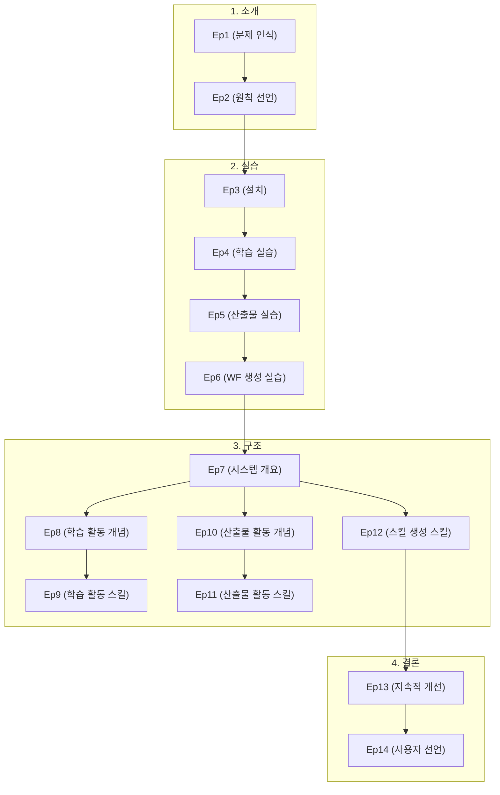

# 시리즈 구조 — AI를 올바르게 쓰는 법

## 시리즈 아크 (Series Arc)

| 파트 | 범위 | 역할 | 독자 상태 |
|------|------|------|-----------|
| **1. 소개 (Cocrates Harness의 필요성과 원칙)** | Ep1~2 | 문제 인식 + 핵심 원칙 선언 | "그래, 맞아. 근데 어떻게 하지?" |
| **2. 실습 (먼저 경험한다)** | Ep3~6 | 설치 + 학습/생성/스킬 생성 실습 | "직접 해보니 궁금해지는구나." |
| **3. 구조 (원리를 이해한다)** | Ep7~12 | 시스템 구조, 학습 및 산출물 생성 활동과 스킬 | "아, 실습에서 경험한 것이 이런 원리였구나." |
| **4. 결론 (지속적 개선과 선언)** | Ep13~14 | 진화, 사용자 선언문 | "이제 내가 할 일을 알겠다." |

---

## 에피소드 구성

### 1. 소개 — Cocrates Harness의 필요성과 원칙 (Ep1~2)

| # | 제목 | 핵심 | 역할 |
|---|------|------|------|
| **1** | 같은 LLM, 다른 결과 | 두 개발자의 대비 — '사용하는 능력'의 차이 | 독자의 공감과 문제 의식 형성 |
| **2** | The Unexamined Code Is Not Worth Generating | Harness Ignorance — 검토되지 않은 산출물은 생성할 가치가 없다 | 핵심 원칙 선언 — 시리즈의 철학적 기반 |

### 2. 실습 — 먼저 경험한다 (Ep3~6)

| # | 제목 | 핵심 | 역할 |
|---|------|------|------|
| **3** | Cocrates Harness 설치 | opencode/cocrates agent plugin 설치, 환경 설정, 기본 동작 확인 | 실제 사용을 위한 첫걸음 |
| **4** | 소크라테스식 학습 활동 - 실습 | Education → Knowledge Capture → Reflection 실제 워크플로우 경험 | 학습 활동 직접 체험 |
| **5** | 구조 기반 산출물 생성 활동 - 실습 | adr → spec → generation/verification 실제 워크플로우 경험 | 산출물 생성 활동 직접 체험 |
| **6** | 구조 기반 워크플로우 생성 실습 | generating-skill-creation 스킬을 직접 사용해 새 워크플로우 만들기 | 워크플로우 생성 직접 체험 |

### 3. 구조 — 원리를 이해한다 (Ep7~12)

| # | 제목 | 핵심 | 역할 |
|---|------|------|------|
| **7** | Cocrates Harness 구조 | Cocrates Agent + Skills 구조, Cocrates Agent Prompt (의도 인식, 스킬 선택, 태스크 관리, 가드레일) | 전체 시스템 조감도 |
| **8** | 소크라테스식 학습 활동 | 능동적 학습을 위한 활동 및 교육 철학 — 왜 소크라테스식 접근인가, Learning 파이프라인(Education → Knowledge Capture → Reflection) 개관 | 학습 활동의 개념적 토대 |
| **9** | 소크라테스식 학습 활동 - 스킬 | Education · Knowledge Capture · Reflection 스킬의 핵심 내용, 각 스킬의 시작/종료 조건과 워크플로우 | 학습 관련 스킬의 구체적 이해 |
| **10** | 구조 기반 산출물 생성 활동 | 구조적 의사결정(ADR)과 사양(Spec) — 왜 구조가 먼저인가, Artifact Generation 파이프라인(ADR → Spec → 생성 → 검증) 개관 | 산출물 생성 활동의 개념적 토대 |
| **11** | 구조 기반 산출물 생성 활동 - 스킬 | adr-writing → spec-writing → spec-driven-generation → spec-driven-verification 스킬의 핵심 내용 | 산출물 생성 관련 스킬의 구체적 이해 |
| **12** | 구조 기반 워크플로우 생성 스킬 | generating-skill-creation 스킬의 핵심 내용 — 새 스킬을 설계·생성하는 원칙과 절차 | 스킬 생성 원리 |

### 4. 결론 — 지속적 개선과 선언 (Ep13~14)

| # | 제목 | 핵심 | 역할 |
|---|------|------|------|
| **13** | 올바른 Cocrates Harness 활용 | Cocrates Harness를 진화시켜야 한다 — 사용자도 에이전트도 지속적 개선이 필요하다 | 지속적 발전의 원칙 |
| **14** | Cocrates Harness 사용자 선언문 | 끊임없이 개선하겠다, 포기하지 않겠다는 사용자의 선언 | 시리즈의 마무리와 실천 다짐 |

---

## 에피소드 간 관계

**독해 순서**: 소개(Ep1~2) → 실습(Ep3~6) → 구조(Ep7~12) → 결론(Ep13~14) 순서로 읽을 것. 실습을 먼저 경험한 뒤 원리를 이해하면, "아, 실습에서 경험한 것이 이런 원리였구나"라는 깨달음을 얻을 수 있다. 구조 파트 내에서는 Ep7(전체 구조)을 먼저 읽고, 이후 Ep8→9(학습 활동)와 Ep10→11(산출물 활동)은 순서대로 읽는 것을 권장. Ep12(워크플로우 생성)는 Ep10~11의 이해가 선행되면 좋음.

---

## 실제 시스템 매핑

| 에피소드 | 대응 실제 시스템 |
|----------|-----------------|
| Ep3 | opencode Cocrates plugin 설정 |
| Ep4~6 | 실습 에피소드 — 별도 실습 파일 |
| Ep7 | `.opencode/agents/cocrates.md` (Cocrates Agent 정의 전체) |
| Ep8 | `.opencode/agents/cocrates.md`의 Learning 파이프라인 |
| Ep9 | `.opencode/skills/education/SKILL.md`, `.opencode/skills/knowledge-capture/SKILL.md`, `.opencode/skills/reflection/SKILL.md` |
| Ep10 | `.opencode/agents/cocrates.md`의 Artifact Generation 파이프라인 |
| Ep11 | `adr-writing`, `spec-writing`, `spec-driven-generation`, `spec-driven-verification` 스킬 + `.opencode/skills/document-authoring/SKILL.md`, `.opencode/skills/presentation-authoring/SKILL.md`, `.opencode/skills/blog-series-authoring/SKILL.md` |
| Ep12 | `.opencode/agents/cocrates.md`의 generating-skill-creation |
| Ep13~14 | 개념 에피소드 — 직접 시스템 대응 없음 |
