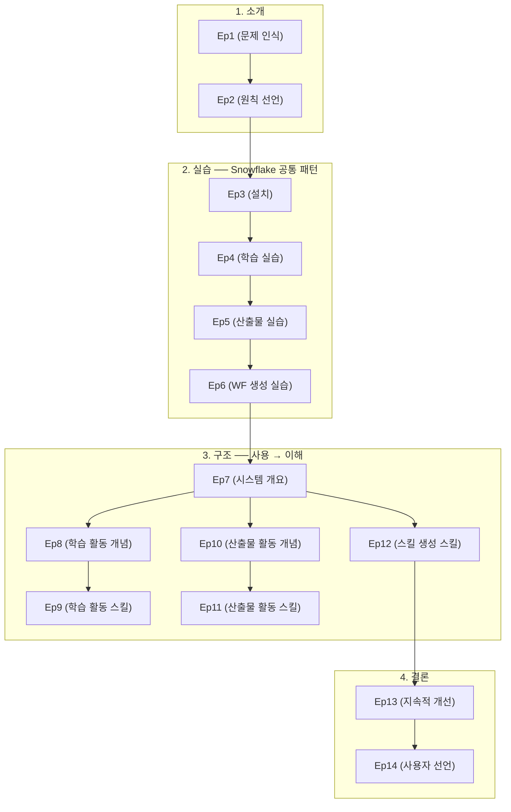

# 시리즈 구조 — AI를 올바르게 쓰는 법

## 시리즈 아크 (Series Arc)

| 파트 | 범위 | 역할 | 독자 상태 |
|------|------|------|-----------|
| **1. 소개 (Cocrates Harness의 필요성과 원칙)** | Ep1~2 | 문제 인식 — AI-assisted vs AI-native의 차이, 핵심 원칙 선언 | "그래, 맞아. 근데 어떻게 하지?" |
| **2. 실습 (먼저 경험한다)** | Ep3~6 | 설치 + 학습/생성/스킬 생성 실습 — **Snowflake 공통 패턴** 경험 | "직접 해보니 궁금해지는구나." |
| **3. 구조 (원리를 이해한다)** | Ep7~12 | 시스템 구조, 학습 및 산출물 생성 활동과 스킬 — "사용"에서 "이해"로 전환 | "아, 실습에서 경험한 것이 이런 원리였구나." |
| **4. 결론 (지속적 개선과 선언)** | Ep13~14 | 진화, 사용자 선언문 | "이제 내가 할 일을 알겠다." |

---

## 에피소드 구성

### 1. 소개 — Cocrates Harness의 필요성과 원칙 (Ep1~2)

| # | 제목 | 핵심 | 역할 | 비고 (발표자료 보완) |
|---|------|------|------|---------------------|
| **1** | 같은 LLM, 다른 결과 | AI-assisted(도구) vs AI-native(팀원) 명확한 구분. "당신의 AI는 몇 명의 팀원인가?" OpenAI 실제 사례(Ryan Lopopolo 팀: 3명, 5개월, 100만 줄, Zero-Code)로 AI-native 가능성 증명. Cocrates = Co+Socrates — 상호 소크라테스 관계의 핵심 철학. | 독자의 공감과 문제 의식 형성 | AI-native Engineer의 개념을 구체적 사례와 함께 명확히 정의. "검토(U→A→E→A)"가 AI-native의 핵심 역량임을 예고. |
| **2** | The Unexamined Code Is Not Worth Generating | 검토의 4단계 — **U(이해) → A(분석) → E(평가) → A(승인)**. Code의 확장 정의(소스 코드뿐 아니라 모든 AI 최종 산출물). 검토의 궁극적 목적 = **무지의 제거(Harnessing Ignorance)**. Cocrates는 사용자의 주도권을 지켜주는 **가드레일**. | 핵심 원칙 선언 — 시리즈의 철학적 기반 | 소크라테스 명언("The unexamined life is not worth living")에서의 영감. Architecture(뼈대)의 중요성을 블로그 시리즈 제작 예시로 설명. |

### 2. 실습 — 먼저 경험한다 (Ep3~6)

| # | 제목 | 핵심 | 역할 | 비고 (발표자료 보완) |
|---|------|------|------|---------------------|
| **3** | Cocrates Harness 설치 | opencode 플랫폼 위에서 동작하는 **플러그인**. Cocrates = **Plugin + Skill**로 구성. 3가지 UI 선택지(터미널/데스크탑/VS Code+OpenChamber). **치트키 설치법** — AI에게 설치 요청 후 Plugin+Skill 확인. 설치 후 첫 질문: "블룸의 분류학에 대해 알려줘". | 실제 사용을 위한 첫걸음 | opencode=극장(플랫폼), Cocrates=배우(플러그인) 비유. 3단계 설치(opencode → plugin → skills) 명확화. 설치조차 검토(U→A→E→A)하라는 원칙 강조. |
| **4** | 소크라테스식 학습 활동 - 실습 | Education → Knowledge Capture → Reflection 실제 워크플로우 경험. 블룸 분류학 학습을 통한 **3가지 깨달음**: ① 피라미드는 진도 순서가 아니라 의존성 구조(Pull 전략) ② 1차원이 아니라 2차원 매트릭스(Knowledge × Cognitive = 24개 셀) ③ Push/Pull 밀당 전략. 파이널 미션: Git 브랜치 전략 커리큘럼 설계(Create 수준). ✅ 확실한 영역 vs ⚠️ 삐걱거리는 영역. | 학습 활동 직접 체험 | "같은 질문, 완전히 다른 답변" — 일반 AI vs Cocrates 응답 비교. Gap 기록(내가 틀렸던 가정)이 핵심 요약보다 강력함을 강조. Reflection = 면접관 모드로 변신. |
| **5** | 구조 기반 산출물 생성 활동 - 실습 | ADR → Spec → Generation → Verification 실제 워크플로우 경험. **AI 제안이 부적절한 3가지 이유**: ① **일반적(Generic)** — 저장 모델 논쟁 ② **쉽고 간단(Simple)** — 아키텍처 논쟁 ③ **품질 미반영(Quality-blind)** — 동시성 모델 논쟁. **Living Cycle** — 검증 피드백이 구조 설계(ADR)로 회귀하는 순환. Undocumented ASR(6건) 발견. | 산출물 생성 활동 직접 체험 | 72개 검증 항목(71 pass, 1 fail). Spec = Single Source of Truth. AI의 제안 = 할루시네이션만 문제가 아니라, Generic/Simple/Quality-blind의 다양한 부적절함. 구조 기반 생성 = Waterfall이 아닌 **Living Cycle**. |
| **6** | 구조 기반 워크플로우 생성 실습 | "보고서 써줘" 대신 "보고서 쓰는 법"을 AI에게 가르친다. **스킬 생성 6단계**: Kernel → Frame → Outline → Spec → Skill → Verification. AI의 "서론→본론→결론" 고정관념을 사용자가 깨고 **6가지 맞춤형 구성 방식**으로 발전. **U→A→J→A**(이해→분석→판단→승인) 프레임워크. **Snowflake 공통 패턴** — Ep4/5/6에 모두 적용. | 워크플로우 생성 직접 체험 | "물고기를 잡아달라" vs "물고기 잡는 법을 배우라" 비유. 7개 검증 항목 전원 PASS. Before/After 비교: 수동적 수용자 → 능동적 설계자. |

### 3. 구조 — 원리를 이해한다 (Ep7~12)

| # | 제목 | 핵심 | 역할 | 비고 (발표자료 보완) |
|---|------|------|------|---------------------|
| **7** | Cocrates Harness 구조 | **Agent + Skills** 구조 — 하나의 거대한 프롬프트가 아닌, Agent(헌법) + Skills(전문가)로 분리. Cocrates Agent Prompt의 **6개 섹션**: Persona → Principle → Harness Architecture → Request Handling → Core Activities → Success Criteria. **Intent-To-Skill Routing** — 8개 의도를 8개 스킬로 매핑. 2가지 Core Activity: Generation Pipeline + Learning Pipeline. "사용 → 이해 → 진화" 사이클. | 전체 시스템 조감도 | One-Size-Fits-All 함정(주방 비유 — 칼마다 용도가 다르다). Cocrates는 **완성된 하네스가 아님** — 사용자가 직접 스킬을 추가/수정/진화시킬 수 있음. |
| **8** | 소크라테스식 학습 활동 - 원리 | **3가지 교육 철학**: ① **소크라테스 산파술(Socratic Maieutics)** — 정답을 주지 않고 질문으로 논리의 모순을 깨닫게 함 ② **블룸의 교육분류학(Bloom's Taxonomy)** — 2차원 매트릭스(Knowledge × Cognitive) ③ **근접발달영역(ZPD) 및 비계 설정(Scaffolding)** — 적절한 인지적 부하. **Learning Pipeline**: Education → Knowledge Capture → Reflection. "알려줘" = 가장 위험한 세 글자. | 학습 활동의 개념적 토대 | 교육 철학의 구체적 연결성 제시. 각 단계가 왜 필요한지(정보 전달의 문제점 → 무지의 눈덩이) 논리적 흐름 강화. |
| **9** | 소크라테스식 학습 활동 - 스킬 | **Education Skill**: 3블록 구조(Concept Briefing → Thought Laboratory → MISSION), No Spoon-feeding 원칙, Push/Pull 전략. **Knowledge Capture Skill**: recall용 핵심만 `kb/`에 저장, "Wrong Assumptions / Gaps" 기록, 병합 전략. **Reflection Skill**: 면접관 모드, KB 기반 평가, ✅ vs ⚠️ 성적표, Gap 발견 시 Education 모드로 전환. | 학습 관련 스킬의 구체적 이해 | 세 스킬의 연결과 순환(Education → Knowledge Capture → Reflection → Education) 명확화. |
| **10** | 구조 기반 산출물 생성 활동 - 원리 | **ASR(Architecturally Significant Requirements)** — 구조적으로 중요한 요구사항 식별. **4단계 Pipeline**: ASR 식별 → ADR(대안 분석) → Spec(결정 통합) → 생성 및 검증. 전원주택 비유로 이해. 구조 기반 접근 vs 무구조 접근의 차이 — **침묵의 기본값(Silent Default)** 개념. | 산출물 생성 활동의 개념적 토대 | "구조"라는 모호한 개념을 ASR로 구체화. Undocumented ASR의 위험성과 검증의 중요성. |
| **11** | 구조 기반 산출물 생성 활동 - 스킬 | **adr-writing**: 하나의 Concern = 하나의 ADR, 최소 2~3개 실질적 대안, bullet-only 스타일, proposed→approved 게이트. **spec-writing**: 자체 완결성(Self-Containment), ADR 참조 금지, 검증 가능한 문장. **spec-driven-generation**: ASR Readiness Gate(8가지 보편 범주), Spec > 프롬프트 우선순위. **spec-driven-verification**: 이중 목적 — Deviation 확인 + Undocumented ASR 발견. | 산출물 생성 관련 스킬의 구체적 이해 | artifact-specific 스킬(document/presentation/blog-series)과의 관계 및 공통 원칙(Snowflake, 단계별 승인 게이트) 명확화. |
| **12** | 구조 기반 워크플로우 생성 스킬 | **generating-skill-creation** — 메타-스킬. **5가지 Artifact Components**: Assignment & Constraints, Context & Rules, Entities, Space & Placement, Structure & Flow. **Meta Snowflake 7단계**: Kernel → Components → Frame → Outline → Spec → Skill → Verification. **Per-Stage Refinement**: 각 구성 요소가 단계별로 다른 속도로 구체화. | 스킬 생성 원리 | 스킬 = AI의 SOP(Standard Operating Procedure). 스킬의 재사용성과 진화. |

### 4. 결론 — 지속적 개선과 선언 (Ep13~14)

| # | 제목 | 핵심 | 역할 | 비고 (발표자료 보완) |
|---|------|------|------|---------------------|
| **13** | 올바른 Cocrates Harness 활용 | **사용자도 진화**: 소크라테스식 질문 내재화, 검토와 승인 습관화. **Cocrates Harness도 진화**: 스킬 확장 가능, 에이전트 프롬프트 커스터마이징 가능. **피드백 루프**: 사용자 경험 → 에이전트/스킬 개선 → 더 나은 경험 → 사용자 성장. **오픈소스 정신**: github.com/cocrates/cocrates.ai, 모든 코드와 프롬프트 공개. | 지속적 발전의 원칙 | 상호 진화 개념 강화. "Cocrates는 완성된 제품이 아니라 함께 성장하는 하네스." |
| **14** | Cocrates 사용자 선언문 | **3가지 핵심 철학**: ① "The unexamined code is not worth generating" ② "I know I know nothing" ③ "Harness Ignorance". **7가지 계명(User Manifesto)**: ① 설계 없는 요구를 거부한다(I do not blindly request) ② 검증 없는 신뢰를 거부한다(I do not blindly trust) ③ 맥락의 주권을 외주 주지 않는다(I do not outsource my sovereignty) ④ 무지를 아는 척 기만하지 않는다(I do not hide my ignorance) ⑤ 인지적 나태함에 맞서 끝까지 투쟁한다(I relentlessly fight against cognitive laziness) ⑥ 언제나 최적의 구조를 갈망한다(I always strive for the optimal) ⑦ 나만의 닫힌 성벽을 쌓지 않는다(I never build a closed fortress). Cocrates Harness(도구) + User Manifesto(의지) = 무한한 역량 확장. | 시리즈의 마무리와 실천 다짐 | AI 주권(AI Sovereignty) 개념 — AI가 주인이 아니라 도구임을 선언. 시리즈 전체 메시지의 집대성. |

---

## 에피소드 간 관계

**독해 순서**: 소개(Ep1~2) → 실습(Ep3~6) → 구조(Ep7~12) → 결론(Ep13~14) 순서로 읽을 것. 실습을 먼저 경험한 뒤 원리를 이해하면, "아, 실습에서 경험한 것이 이런 원리였구나"라는 깨달음을 얻을 수 있다. 구조 파트 내에서는 Ep7(전체 구조)을 먼저 읽고, 이후 Ep8→9(학습 활동)와 Ep10→11(산출물 활동)은 순서대로 읽는 것을 권장. Ep12(워크플로우 생성)는 Ep10~11의 이해가 선행되면 좋음.

---

## 실제 시스템 매핑

| 에피소드 | 대응 실제 시스템 |
|----------|-----------------|
| Ep3 | opencode Cocrates plugin + `~/.config/opencode/skills/` |
| Ep4~6 | 실습 에피소드 — 별도 실습 파일 |
| Ep7 | `.opencode/agents/cocrates.md` (Cocrates Agent 정의 전체) |
| Ep8 | `.opencode/skills/education/SKILL.md`, `.opencode/skills/knowledge-capture/SKILL.md`, `.opencode/skills/reflection/SKILL.md` |
| Ep9 | `.opencode/skills/education/SKILL.md`, `.opencode/skills/knowledge-capture/SKILL.md`, `.opencode/skills/reflection/SKILL.md` |
| Ep10 | `adr-writing`, `spec-writing`, `spec-driven-generation`, `spec-driven-verification` 스킬 + `.opencode/skills/document-authoring/SKILL.md`, `.opencode/skills/presentation-authoring/SKILL.md`, `.opencode/skills/blog-series-authoring/SKILL.md` |
| Ep11 | `adr-writing`, `spec-writing`, `spec-driven-generation`, `spec-driven-verification` 스킬 + `.opencode/skills/document-authoring/SKILL.md`, `.opencode/skills/presentation-authoring/SKILL.md`, `.opencode/skills/blog-series-authoring/SKILL.md` |
| Ep12 | `.opencode/skills/generating-skill-creation/SKILL.md` |
| Ep13~14 | 개념 에피소드 — 직접 시스템 대응 없음 |
