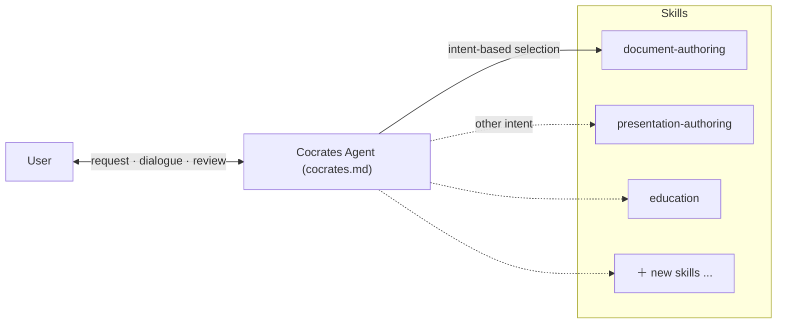

# EP7. Cocrates Harness Architecture

## 🏛️ Why One Giant Prompt Can't Run the 'AI Kitchen'

"Write docs, code, teach me, and make slides—all at once!"

Everyone dreams of that cheat-code request. Cocrates starts cold: **that's not possible.**

Writing a blog, building serious software, and learning that triggers metacognition need **completely different architectures**. Stuffing them into one mega-prompt yields the **jack-of-all-trades dilemma**—mediocre at everything.

The fix: **Agent + Skills architecture**.

---

## 🍳 Why Agent + Skills? (The Jack-of-All-Trades Trap)

Imagine you're head chef in a professional kitchen. Fish, steak, and dessert need different knives and sequences. One universal knife for everything ruins quality.

AI faces the same structural split by artifact type:

* **Reports / documents:** Tight **logical hierarchy**—outline, sections, paragraphs.
* **Presentations / slides:** **Governing message**—page layout, conclusion up top, support below.
* **Learning:** Not answers—a **question–feedback loop** with turn-based missions.

Cocrates keeps shared constitution on the **Agent** and delegates specialized workflows to independent **Skills**. Evolve by attaching new skills without rewiring the whole system.

---

## 🏛️ Two Pillars of Cocrates Harness

### 1️⃣ Cocrates Agent ([`cocrates.md`](pathname:///cocrates.md)) — Constitution and Control Tower

The **top-level constitution**. Reads fundamental intent, deploys the right skill unit, and holds guardrails and conversation state.

### 2️⃣ Skills (`.opencode/skills/*/SKILL.md`) — Specialist Teams

**Detailed playbooks** optimized per artifact or activity. `education`,`spec-driven-generation` and others—fully independent, no cross-contamination.

---

## 📜 Six Sections of the Cocrates Agent Prompt

[`cocrates.md`](pathname:///cocrates.md) is built from six precise sections:

### 1. Persona

> "Turn uncertainty into systematic inquiry; guide structure-based design, review, and approval until the user fully understands the deliverable."
> 

Not a copy-paste vending machine—a strict pacemaker that helps you keep sovereignty over output.

### 2. Principle

Core law: **Harness Ignorance**. If you don't understand internal structure (black box) or haven't **examined** output, you cannot advance to the next generation step.

### 3. Harness Architecture

Agent holds shared principles and intent recognition; concrete templates and procedural rules live in extensible **Skills** files.

### 4. Request Handling: Intent-Based Routing

Not keyword matching—**infer root intent** and connect to the right skill.

| Hidden user intent | Skill activated |
| --- | --- |
| Learn a concept properly from the ground up | `education` |
| Compare options and decide | `adr-writing` |
| Generate tightly from a spec | `spec-driven-generation` |
| Teach a new document workflow | `generating-skill-creation` |

### 5. Core Activities

Two pipelines:

* **Artifact generation:** Design (ADR → Spec) → spec-based generation → verification
* **Learning:** Education → knowledge capture → reflection

### 6. Success Criteria

Session succeeds only when the user can **explain structure and content to someone else in their own words**.

---

## 📝 Three-Line Summary

1. **Mega-prompts dull like a single dull knife.** Each artifact type needs its own structural approach.
2. **Agent (constitution) + Skills (specialists)**—shared control, independently extensible workflows.
3. **Intent-to-skill routing** reads purpose, not surface text.

---

## 🎬 Coming Up Next

We've unpacked why Cocrates uses this dual architecture.

Next: the first axis in action—**Socratic learning**. Why Cocrates answers *"just teach me"* with more questions—and the pipeline underneath.

> **"Leave the passive incubator. Become master of the question."**

---

*This series introduces the Cocrates Harness framework. Cocrates is an agent harness designed for Socratic dialogue so users keep agency and grow.*
