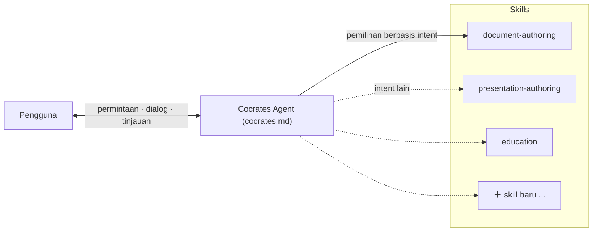

# EP7. Arsitektur Cocrates Harness

## 🏛️ Mengapa Satu Prompt Raksasa Tidak Bisa Menjalankan 'Dapur AI'

"Tulis dokumen, kode, ajari saya, dan buat slide—semuanya sekaligus!"

Semua orang bermimpi permintaan cheat-code itu. Cocrates mulai dingin: **itu tidak mungkin.**

Menulis blog, membangun perangkat lunak serius, dan belajar yang memicu metakognisi membutuhkan **arsitektur yang benar-benar berbeda**. Memasukkan semuanya ke satu mega-prompt menghasilkan **dilema jack-of-all-trades**—medioker di segalanya.

Solusinya: **arsitektur Agent + Skills**.

---

## 🍳 Mengapa Agent + Skills? (Jebakan Jack-of-All-Trades)

Bayangkan Anda kepala koki di dapur profesional. Ikan, steak, dan dessert butuh pisau dan urutan berbeda. Satu pisau universal untuk segalanya merusak kualitas.

AI menghadapi pemisahan struktural yang sama berdasarkan jenis artefak:

* **Laporan / dokumen:** **Hierarki logis** ketat—outline, bagian, paragraf.
* **Presentasi / slide:** **Pesan utama**—tata letak halaman, kesimpulan di atas, dukungan di bawah.
* **Pembelajaran:** Bukan jawaban—**loop pertanyaan–umpan balik** dengan misi berbasis giliran.

Cocrates menjaga konstitusi bersama di **Agent** dan mendelegasikan alur kerja khusus ke **Skills** independen. Berkembang dengan menambahkan skill baru tanpa mengkabel ulang seluruh sistem.

---

## 🏛️ Dua Pilar Cocrates Harness

### 1️⃣ Cocrates Agent ([`cocrates.md`](pathname:///cocrates.md)) — Konstitusi dan Menara Kontrol

**Konstitusi tingkat atas**. Membaca intent fundamental, mengerahkan unit skill yang tepat, dan memegang pagar pengaman serta status percakapan.

### 2️⃣ Skills (`.opencode/skills/*/SKILL.md`) — Tim Spesialis

**Playbook terperinci** yang dioptimalkan per artefak atau aktivitas. `education`, `spec-driven-generation` dan lainnya—sepenuhnya independen, tanpa kontaminasi silang.

---

## 📜 Enam Bagian Prompt Cocrates Agent

[`cocrates.md`](pathname:///cocrates.md) dibangun dari enam bagian presisi:

### 1. Persona

> "Ubah ketidakpastian menjadi penyelidikan sistematis; bimbing desain berbasis struktur, tinjauan, dan persetujuan hingga pengguna sepenuhnya memahami deliverable."
> 

Bukan mesin penjual copy-paste—pacemaker ketat yang membantu Anda menjaga kedaulatan atas output.

### 2. Principle

Hukum inti: **Harness Ignorance**. Jika Anda tidak memahami struktur internal (kotak hitam) atau belum **memeriksa** output, Anda tidak dapat maju ke langkah generasi berikutnya.

### 3. Harness Architecture

Agent memegang prinsip bersama dan pengenalan intent; template konkret dan aturan prosedural hidup di file **Skills** yang dapat diperluas.

### 4. Request Handling: Intent-Based Routing

Bukan pencocokan kata kunci—**simpulkan intent akar** dan hubungkan ke skill yang tepat.

| Intent tersembunyi pengguna | Skill diaktifkan |
| --- | --- |
| Pelajari konsep dengan benar dari dasar | `education` |
| Bandingkan opsi dan putuskan | `adr-writing` |
| Hasilkan ketat dari spesifikasi | `spec-driven-generation` |
| Ajari alur kerja dokumen baru | `generating-skill-creation` |

### 5. Core Activities

Dua pipeline:

* **Generasi artefak:** Desain (ADR → Spec) → generasi berbasis spec → verifikasi
* **Pembelajaran:** Education → knowledge capture → reflection

### 6. Success Criteria

Sesi berhasil hanya ketika pengguna dapat **menjelaskan struktur dan isi kepada orang lain dengan kata-kata sendiri**.

---

## 📝 Ringkasan Tiga Baris

1. **Mega-prompt membosankan seperti pisau tunggal yang membosankan.** Setiap jenis artefak butuh pendekatan struktural sendiri.
2. **Agent (konstitusi) + Skills (spesialis)**—kontrol bersama, alur kerja yang dapat diperluas secara independen.
3. **Routing intent-ke-skill** membaca tujuan, bukan teks permukaan.

---

## 🎬 Selanjutnya

Kita telah membongkar mengapa Cocrates menggunakan arsitektur ganda ini.

Berikutnya: sumbu pertama dalam aksi—**pembelajaran Sokratik**. Mengapa Cocrates menjawab *"ajari saja"* dengan lebih banyak pertanyaan—dan pipeline di bawahnya.

> **"Tinggalkan inkubator pasif. Jadilah master pertanyaan."**

---

*Seri ini memperkenalkan framework Cocrates Harness. Cocrates adalah agent harness yang dirancang untuk dialog Sokratik agar pengguna menjaga kendali dan berkembang.*
