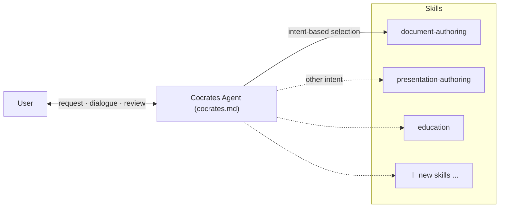

# EP7. Cocrates Harness 架构

## 🏛️ 为何一个巨型 Prompt 跑不了「AI 厨房」

「写文档、写代码、教我、做幻灯片——一次全搞定！」

人人都梦想这种作弊请求。Cocrates 冷静开场：**那不可能。**

写博客、做严肃软件、触发元认知的学习——需要**完全不同的架构**。全塞进一个 mega-prompt 就会陷入**样样通样样松**——什么都平庸。

解法：**Agent + Skills 架构**。

---

## 🍳 为何 Agent + Skills？（样样通陷阱）

想象你是专业厨房的主厨。鱼、牛排、甜点需要不同刀法与顺序。一把万能刀什么都切，质量就毁了。

AI 按制品类型也面临同样的结构分裂：

* **报告 / 文档：** 严密的**逻辑层级**——大纲、章节、段落。
* **演示 / 幻灯片：** **统领信息**——版式、结论置顶、论据在下。
* **学习：** 不是答案——**问答-反馈循环**与回合制任务。

Cocrates 把共享宪法放在 **Agent**，把专门工作流交给独立的 **Skills**。挂上新 skill 即可演进，不必重写整个系统。

---

## 🏛️ Cocrates Harness 两大支柱

### 1️⃣ Cocrates Agent（[`cocrates.md`](pathname:///cocrates.md)）——宪法与控制塔

**顶层宪法**。读取根本意图，部署合适的 skill 单元，并守住护栏与对话状态。

### 2️⃣ Skills（`.opencode/skills/*/SKILL.md`）——专业团队

按制品或活动优化的**详细 playbook**。`education`、`spec-driven-generation` 等——完全独立，互不污染。

---

## 📜 Cocrates Agent Prompt 的六个部分

[`cocrates.md`](pathname:///cocrates.md) 由六个精确部分组成：

### 1. Persona

> 「把不确定性转化为系统化探究；引导基于结构的设计、审查与批准，直到用户完全理解交付物。」
> 

不是复制粘贴贩卖机——帮你对产出保持主权的严格配速员。

### 2. Principle

核心法则：**Harness Ignorance**。若你不理解内部结构（黑箱）或未**审视**产出，就不能进入下一步生成。

### 3. Harness Architecture

Agent 持有共享原则与意图识别；具体模板与程序规则在可扩展的 **Skills** 文件里。

### 4. Request Handling: Intent-Based Routing

不是关键词匹配——**推断根本意图**并连到对的 skill。

| 隐含的用户意图 | 激活的 Skill |
| --- | --- |
| 从零扎实学习某个概念 | `education` |
| 比较选项并做出决定 | `adr-writing` |
| 严格依据 spec 生成 | `spec-driven-generation` |
| 教授新的文档工作流 | `generating-skill-creation` |

### 5. Core Activities

两条流水线：

* **制品生成：** Design（ADR → Spec）→ 基于 spec 的生成 → verification
* **学习：** Education → knowledge capture → reflection

### 6. Success Criteria

只有当用户能**用自己的话向别人解释结构与内容**时，会话才算成功。

---

## 📝 三行总结

1. **Mega-prompt 像一把钝刀一样变钝。** 每种制品类型需要自己的结构方法。
2. **Agent（宪法）+ Skills（专家）**——共享控制，可独立扩展的工作流。
3. **意图到 skill 的路由**读的是目的，不是表面文字。

---

## 🎬 下期预告

我们已拆解 Cocrates 为何采用这种双架构。

下一集：第一条轴线的实战——**苏格拉底式学习**。为何 Cocrates 对*「直接教我」*用更多问题回应——以及底下的流水线。

> **「离开被动孵化器。成为提问的主人。」**

---

*本系列介绍 Cocrates Harness 框架。Cocrates 是为苏格拉底式对话设计的 agent harness，使用户保留主导权并持续成长。*
