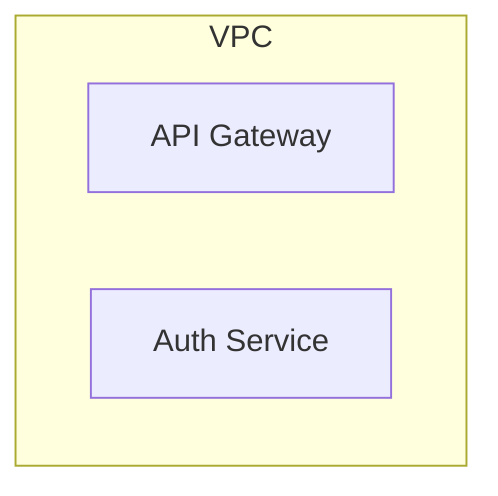
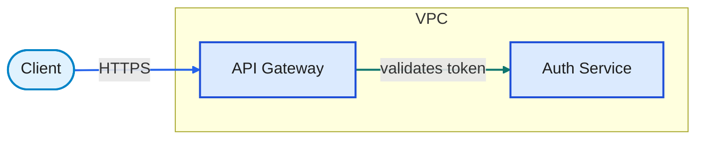
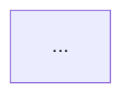

# Mermaid.js Generator (Stage 3 — How)

Turn approved YAML (**what**) into a **Mermaid flowchart** (**how**), or **reverse-read** Mermaid source for analysis / YAML recovery.

- Forward & reverse workflow: [`SKILL.md`](../SKILL.md)
- Other generators: [`README.md`](README.md)

**Hard rules:** Do not invent story meaning, elements, or relationships. Do not write pixel layout into YAML. Optimize for Mermaid flowchart idioms (`flowchart`, `subgraph`, `classDef`) — pixel layout is owned by the Mermaid renderer; this generator owns **visual rhythm** (spacing init, direction consistency, declaration order, shape bands).

**Status:** Supported. **Default diagram form: `flowchart`.**

## When to use

| Situation | Action |
|-----------|--------|
| Generate Mermaid / `.mmd` / markdown fence | Structure → emit → validate (this file) |
| Stage 2 YAML approved; user wants Mermaid | Same (`backend: mermaid`) |
| Analyze / recover YAML from Mermaid source | **Reverse reading** + [`SKILL.md`](../SKILL.md) Analyze & recover |
| Another backend | [`README.md`](README.md) |

**Forward prerequisite:** Approved `title`, `summary`, `explanation`, `diagram.elements`, `diagram.relationships`.

Do **not** switch to `sequenceDiagram` / `classDiagram` / `erDiagram` unless the user explicitly requests that form. Default remains **flowchart**.

## Input / output

| Direction | Input | Output |
|-----------|-------|--------|
| Forward | `{slug}.yaml` (+ optional `backend: mermaid`, `output`, `legend`) | `{slug}.mmd` by default; or `{slug}.md` with a fenced `mermaid` block if the user asks for markdown |
| Reverse | `.mmd`, `.md` fence, or pasted Mermaid | Explanation and/or Stage-2 YAML (what only) |

## Pipeline (forward)

```
1. Read approved YAML
2. Design structure (visual rhythm → direction → subgraphs → class/link styles → optional legend)
3. Emit Mermaid source (.mmd or fenced .md)
4. Run Parts 1–5 validation → report pass/fail to user
5. On failure → revise source and re-validate (never write layout coords into YAML)
```

---

## Constants

| Token | Value |
|-------|-------|
| Default form | `flowchart` |
| Direction | `LR` if explanation is left→right / request flow; else `TB` (top→bottom) |
| Containment | `subgraph` from `parentId` |
| Node id | YAML element `id` (English kebab-case → Mermaid-safe: use the id as-is if valid, else quote) |
| Edge label | Relationship `label` when present |
| Font / theme | Rely on Mermaid defaults + `classDef` fills/strokes below |
| **Spacing init** | Prefer `nodeSpacing: 50`, `rankSpacing: 50`, `padding: 16` via `%%{init:…}%%` (even rhythm; not pixel grid) |

Mermaid does **not** support pixel grid snap or forced equal box sizes. Aim for an even, intentional look through **structure, declaration order, spacing init, and consistent shapes** — not coordinates.

---

## Structure design (flowchart)

### Visual rhythm (required)

Pixel grid is impossible here; still make the diagram feel **even and intentional** via the Visual rhythm rules below.

| Rule | Detail |
|------|--------|
| **Even spacing init** | Emit a top-of-file init (after optional title comment) so ranks/nodes share a stable rhythm: `%%{init: {"flowchart": {"nodeSpacing": 50, "rankSpacing": 50, "padding": 16, "htmlLabels": true}}}%%`. Keep values consistent across files from this generator unless the user asks otherwise. |
| **One flow axis** | Pick `LR` or `TB` from `explanation` and stick to it. Nested subgraphs use the **same** `direction` as the outer flowchart unless a nested group is clearly a counter-axis stack (document that exception in a `%%` comment). |
| **Declaration order = reading order** | List peer nodes in the order a speaker would point while reading `explanation` (left→right or top→bottom). Do not shuffle siblings arbitrarily. |
| **Peer kind bands** | Same `kind` among siblings → same shape syntax (all `["…"]`, all `(["…"])`, etc.). Do not mix stadium/rect/cylinder for peers that share a role. |
| **Label length discipline** | Prefer short labels so the renderer’s auto-sized boxes stay comparable. When one peer label is much longer, shorten via wording (still faithful to YAML `label`) only if the YAML label already fits; otherwise keep YAML text — do not invent alternate copy. Break lines only at phrase boundaries. |
| **Subgraph as columns/rows** | One subgraph ≈ one visual band. Sibling containers declared in flow order. Avoid empty spacer nodes. |
| **Edge alignment cues** | Prefer a single primary spine of links along the flow axis; fan-out/fan-in from that spine. Avoid criss-cross edge soup that fights rank layout. Use `A --> B & C` (parallel) only when peers truly share the same hop. |
| **Legend placement** | Legend subgraph last in the file; `direction TB`; never linked to story nodes — keeps story ranks clean. |

**Not required (and not possible):** snapping `x/y/width/height`, forcing equal pixel box sizes, or midpoint docking. Those belong to pixel/canvas backends only.

### Direction

| Cue from `explanation` | Directive |
|------------------------|-----------|
| Request / pipeline / “left to right” | `flowchart LR` |
| Hierarchy / stack / “top down” | `flowchart TB` |
| Unclear | `flowchart TB` |

Typical header:

```mermaid
%% {title}
%%{init: {"flowchart": {"nodeSpacing": 50, "rankSpacing": 50, "padding": 16, "htmlLabels": true}}}%%
flowchart LR
```

### Composition rules

- **Visual rhythm:** Apply the table above — non-negotiable for a finished Mermaid look.  
- **Reading order:** Match `explanation` via `LR` / `TB`, edge direction, and **declaration order**.  
- **Containment:** Each `parentId` child is declared **inside** that parent’s `subgraph`. No containment-only edge.  
- **Nesting:** Nested `parentId` chains → nested `subgraph` blocks; nested `direction` matches outer unless intentionally different.  
- **Peers:** Declare siblings in flow order; same-kind peers share shape syntax; do not fake pixel gaps with dummy nodes.  
- **Kinds / types:** `classDef` / `class` for nodes; link syntax + optional `linkStyle` for edges.  
- **Labels:** Node text = element `label` (user language). Escape Mermaid-special characters in labels (`"`, `]`, etc.) via quotes. Prefer concise labels for even auto-sizing.  
- **Edges:** One link per relationship; honor `direction`; put `label` on the link when present; prefer a clear spine along the flow axis.  
- **Legend:** Optional — see Legends.

### Containment → subgraph



Rules:

1. Subgraph **id** = parent element `id` (sanitize: prefer snake or keep kebab in quotes if needed — Mermaid subgraph ids are typically alphanumeric/`_`; map `api-gateway` node ids safely).  
2. **Node id sanitization:** Mermaid node ids should be `[A-Za-z][A-Za-z0-9_]*`. Convert YAML kebab-case `api-gateway` → `api_gateway` in Mermaid source; keep YAML ids in comments if useful: `%% yaml: api-gateway`.  
3. Subgraph **title** = parent `label`.  
4. Children only appear inside their parent subgraph (not also at root).  
5. Set `direction LR` or `TB` inside subgraph to **match** the outer flowchart by default.  
6. Declare children in flow / explanation order.  
7. Never draw `has-a` / `contains` as an arrow.

### Node shapes by `kind`

| `kind` | Mermaid shape | Example |
|--------|---------------|---------|
| `actor` | stadium / rounded | `id(["Label"])` or `id(["Label"])` |
| `system` | rectangle | `id["Label"]` |
| `process` | rectangle | `id["Label"]` |
| `data` | cylinder (as subroutine/stadium alternative) | `id[("Label")]` (cylindrical) or `id[(Label)]` |
| `boundary` / `group` / `frame` | **subgraph only** (no extra leaf node unless the container also needs a lone node — prefer subgraph title) | `subgraph id["Label"]` |
| default | rectangle | `id["Label"]` |

Prefer:

```mermaid
actor_id(["Client"])
system_id["API Gateway"]
data_id[("Database")]
```

(`(["…"])` stadium for actors; `[("…")]` cylinder for data.)

### Edges by `direction` and `type`

**Direction → link syntax**

| `direction` | Syntax |
|-------------|--------|
| `directed` | `A -->|label| B` or `A --> B` |
| `undirected` | `A ---|label| B` or `A --- B` |
| `bi-directed` | `A <-->|label| B` or `A <--> B` |

Omit `|label|` when relationship has no `label`.

**Type → visual distinction**

Mermaid link styling is limited. Combine:

1. **Stable linkStyle** by edge order (after all edges declared), and/or  
2. **Label prefix** when type would otherwise be invisible: keep human `label`; if empty, optional type hint is OK only when needed for clarity.

| `type` | `stroke` | `stroke-dasharray` | Notes |
|--------|----------|-------------------|--------|
| `flows-to` | `#2563eb` | solid | |
| `requests` | `#7c3aed` | solid | |
| `uses` / `calls` | `#0f766e` | solid | |
| `precedes` / `follows` | `#4b5563` | `3` (dashed) | |
| `is-a` | `#b45309` | solid | |
| `implements` | `#be185d` | `3` | |
| `associates` | `#6b7280` | solid | thinner if supported |
| `has-a` / `contains` | — | — | **Do not emit a link** |

Example:

```mermaid
api_gateway -->|validates token| auth_service
linkStyle 0 stroke:#0f766e,stroke-width:2px;
```

`linkStyle` index is the **0-based order of links** in the file. Keep a running index while emitting edges. If a renderer ignores `linkStyle`, type distinction still appears via labels + direction syntax; note that in validation.

**Custom / unknown `kind` or `type`:** Same policy as other generators — map to closest built-in, else assign a stable custom `classDef` / stroke and reuse for that slug; note in chat / legend.

---

## classDef (element palette)

Emit one `classDef` per **used** kind (built-in or custom), then `class` assignments.

| `kind` | Example `classDef` |
|--------|-------------------|
| `actor` | `classDef actor fill:#e0f2fe,stroke:#0284c7,stroke-width:2px,color:#1e1e1e;` |
| `system` | `classDef system fill:#dbeafe,stroke:#1d4ed8,stroke-width:2px,color:#1e1e1e;` |
| `process` | `classDef process fill:#f3f4f6,stroke:#374151,stroke-width:2px,color:#1e1e1e;` |
| `data` | `classDef data fill:#fef3c7,stroke:#d97706,stroke-width:2px,color:#1e1e1e;` |
| `boundary` | `classDef boundary fill:#fafafa,stroke:#9ca3af,stroke-width:2px,stroke-dasharray:5 5,color:#1e1e1e;` |
| `group` | `classDef group fill:#f8fafc,stroke:#94a3b8,stroke-width:2px,stroke-dasharray:5 5,color:#1e1e1e;` |

```mermaid
classDef system fill:#dbeafe,stroke:#1d4ed8,stroke-width:2px,color:#1e1e1e;
class api_gateway,auth_service system;
```

Apply classes to leaf nodes. Subgraph styling is renderer-dependent; rely on subgraph titles + dashed class on a optional border node only if needed — prefer clean subgraphs.

---

## Document shape

### Preferred output (`.mmd`)



### Markdown fence (when user wants `.md`)

````markdown
# Auth request path


````

### Init / theme

Always emit the **light spacing init** from Visual rhythm (`nodeSpacing` / `rankSpacing` / `padding`). Do **not** force heavy theme overrides (custom fonts, dark backgrounds, large `themeVariables` blocks) unless the user asks. Prefer portable `classDef` + `linkStyle` for color.

---

## Legends (optional)

Same show/omit policy as other generators (`legend: true|false`, user ask, or ≥2 kinds / ≥2 relationship types).

**Mermaid approach:** append a subgraph that does **not** connect to the story:

```mermaid
subgraph legend["Legend"]
  direction TB
  leg_actor(["actor"])
  leg_system["system"]
  leg_flows_a[" "] -.->|flows-to| leg_flows_b[" "]
end

class leg_actor actor;
class leg_system system;
```

Or a short `%% Legend: actor=stadium/sky; system=rect/blue; flows-to=blue arrow; uses=teal arrow` comment block when a visual legend would clutter.

Prefer a **visual subgraph** when kinds/types are many; prefer **comments** for tiny boards. Never link legend nodes to story nodes. Use ids prefixed `leg_` / `legend_`.

---

## YAML → Mermaid map

| YAML | Mermaid |
|------|---------|
| `elements[]` | Node (or subgraph if container-only) |
| `kind` | Shape syntax + `classDef` / `class` |
| `parentId` | Membership in parent `subgraph` |
| `relationships[]` | Link with direction syntax + optional `linkStyle` |
| Containment | `subgraph` only |

---

## Reverse reading

For explain / recover / validate-by-explain ([`SKILL.md`](../SKILL.md) Analyze & recover):

1. Detect `flowchart` / `graph` direction (`TB`/`LR`/…).  
2. Parse nodes → elements (`label` from display text; sanitize id back toward kebab-case).  
3. Parse `subgraph` membership → `parentId`.  
4. Parse links → relationships; `-->` / `<-->` / `---` → `direction`; guess `type` from `linkStyle` / label when possible.  
5. Skip `leg_` / `legend` subgraphs.  
6. Draft `explanation` along flowchart direction and edge order.

Recovered YAML has **no** layout fields. Note uncertainty when shapes/styles are ambiguous.

---

## Output validation

Report Parts 1–5 in chat. Geometry checks are **structural** (not pixel).

### Part 1 — Structure & visual rhythm

| # | Pass means |
|---|------------|
| 1.1 | Starts with `flowchart LR` or `flowchart TB` (or `graph` equivalent) matching the script |
| 1.2 | Every `parentId` child appears only inside the parent `subgraph` |
| 1.3 | Nested `parentId` → nested subgraphs |
| 1.4 | No containment-only links |
| 1.5 | No duplicate node ids |
| 1.6 | Containers that only group children are subgraphs (not fake peer boxes) |
| 1.7 | Spacing `%%{init:…}%%` present with even `nodeSpacing` / `rankSpacing` (defaults 50/50 unless user override) |
| 1.8 | Nested subgraph `direction` matches outer unless intentional exception is commented |
| 1.9 | Peer declaration order follows reading / `explanation` order |
| 1.10 | Same-kind siblings use the same shape syntax; no dummy spacer nodes |

### Part 2 — Labels & readability

| # | Pass means |
|---|------------|
| 2.1 | Every element has visible text (`label`) |
| 2.2 | Special characters safely quoted/escaped |
| 2.3 | Line breaks only at natural boundaries |
| 2.4 | Edge labels present when YAML has `label` |
| 2.5 | Node ids Mermaid-safe (`[A-Za-z][A-Za-z0-9_]*`) |

### Part 3 — Edges

| # | Pass means |
|---|------------|
| 3.1 | Every YAML relationship has exactly one link (except contains/has-a) |
| 3.2 | Endpoints resolve to declared nodes |
| 3.3 | Link syntax matches `direction` |
| 3.4 | Flow direction consistent with `flowchart LR/TB` + `explanation` |
| 3.5 | `linkStyle` indices match edge order when used |
| 3.6 | Minimal unnecessary cross-links that scramble the walkthrough |

### Part 4 — Style & types

| # | Pass means |
|---|------------|
| 4.1 | Used kinds have `classDef` + `class` (or clear shape distinction) |
| 4.2 | Co-existing kinds distinguishable (shape and/or class colors) |
| 4.3 | Relationship types distinguished via `linkStyle` and/or labels |
| 4.4 | Co-existing types not all identical anonymous `-->` with no cues |
| 4.5 | No `has-a`/`contains` links |
| 4.6 | Custom kind/type mappings stable and noted if used |
| 4.7 | Legend policy respected; legend not wired into the story |

### Part 5 — Script & file

| # | Pass means |
|---|------------|
| 5.1 | `explanation` concepts appear as nodes/edges/subgraphs |
| 5.2 | Speaking `explanation` while reading the flowchart feels natural |
| 5.3 | No junk nodes (legend OK) |
| 5.4 | No invented story graph |
| 5.5 | Valid Mermaid flowchart; renders in GitHub / Mermaid Live / common previewers |

---

## Prohibitions

- Using `sequenceDiagram` / `classDiagram` / `erDiagram` by default when the user asked for a normal diagram (stick to **flowchart** unless requested)  
- Inventing nodes/edges not in YAML  
- Containment arrows instead of `subgraph`  
- Unsafe bare ids (`api-gateway` without sanitizing to `api_gateway`)  
- Homogeneous styling that ignores `kind` / `type`  
- Wiring legend samples into the story graph  
- Writing pixel layout / fake spacer nodes into Mermaid “to force a grid”  
- Skipping visual-rhythm init or mixing peer shapes / declaration order without reason  
- Writing pixel layout into YAML  
- Shipping without Parts 1–5 validation report  
- Emitting a different backend format from this generator (use the matching file under [`README.md`](README.md))

---

## Minimal complete example

YAML (abbrev.) → Mermaid:


