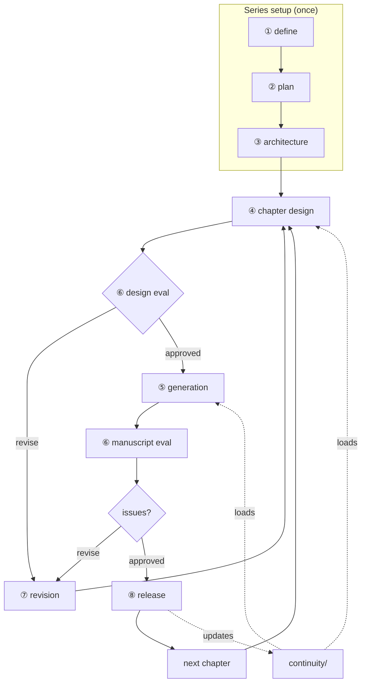

# Novel Authoring — Long-Form Fiction Generation Skill

Produces **complete narrative fiction** — from a single short story to a multi-volume epic — through a structured, stage-gated pipeline. Each stage produces artifact files; each requires **explicit user approval** before proceeding.

**Publication unit:** **Chapter** — sized for web-novel serialization. Episodes are design subdivisions within a chapter; they are not separately published, released, evaluated, or planned at define stage.

**Define stage (①):** Plan scale and release by **chapters only**. Do not ask total episode count, episodes per chapter, words per episode, or episode release schedule — see `01-define.md`.

---

## How to Use This Skill

**This file (`SKILL.md`)** — always loaded. Contains pipeline rules, chapter loop, approval gates, and global constraints. **Read on every session** when working on a novel.

**Workflow files (`workflow/`)** — read **at the start of each stage** for step-by-step procedure, templates, and checklists. Re-read when resuming that stage.

| Stage | Purpose | Workflow | Gate artifact |
|-------|---------|----------|---------------|
| ① define | Lock scope, genre, criteria; **chapter-scale planning only** | [`01-define.md`](workflow/01-define.md) | `overview.md` |
| ② plan | Series arc + Part Catalog (no chapter details) | [`02-plan.md`](workflow/02-plan.md) | `series.md` |
| ③ architecture | Characters, locations, world, part chapter lists, chapter catalogs | [`03-architecture.md`](workflow/03-architecture.md) | `characters.md`, `locations.md`, `world-bible.md`, `parts/`, `chapters/` |
| ④ chapter design | Chapter design + Episode List + episode/scene design | [`04-chapter-design.md`](workflow/04-chapter-design.md) | `chapters/{nnn}-{chapter-slug}.md` + `chapters/{nnn}-{chapter-slug}/` |
| ⑤ generation | Chapter prose (combines all episodes) | [`05-generation.md`](workflow/05-generation.md) | `manuscripts/{nnn}-{chapter-slug}.md` |
| ⑥ evaluation | Design and/or manuscript validation + critique | [`06-evaluation.md`](workflow/06-evaluation.md) | `evaluations/{nnn}-{chapter-slug}.md` |
| ⑦ revision | Design-first fixes | [`07-revision.md`](workflow/07-revision.md) | Updated design/manuscript |
| ⑧ release | Lock chapter; update continuity | [`08-release.md`](workflow/08-release.md) | Continuity files |
| (any) | Optional research | [`research.md`](workflow/research.md) | `docs/{topic}.md` |

### Default Chapter Loop

Unless the user explicitly requests batching:

```
④ design chapter N (chapter file + all episode files) → user approves
  → ⑥ evaluate design (recommended) → user selects revisions
    → ⑦ revise design (if needed) → user approves
      → ⑤ write chapter manuscript → user approves
        → ⑥ evaluate manuscript → user selects revisions
          → ⑦ revise (if needed) → user approves
            → ⑧ release + update continuity
              → ④ design chapter N+1 → ...
```



**Hard rules:**
- Do not start chapter N+1 until chapter N is **released** (⑧ complete)
- Every artifact requires **explicit user approval** before proceeding
- **Design evaluation before manuscript** is strongly recommended — fixing structure at design stage is more efficient than revising prose
- Batching and design-ahead are **opt-in only** — each chapter still needs individual approval before its manuscript

### Approval Applies To

- `overview.md`, `series.md`, architecture files
- Each `chapters/{nnn}-{chapter-slug}.md` and all episode files in its folder
- Each `manuscripts/{nnn}-{chapter-slug}.md`
- Each `evaluations/{nnn}-{chapter-slug}.md` and revision decisions
- Release confirmation (stage ⑧)
- Any new character, location, or world rule (architecture update first)

### Design-Ahead (Opt-In)

Only when the user requests designing multiple chapters before writing manuscripts:

- Each chapter design loads continuity as of the last **released** chapter
- Each design requires individual approval before its manuscript
- Earlier designs may be revised after later ones reveal conflicts

### Agent Procedure

1. **State the current stage** (e.g., *"Stage ④ — chapter design."*)
2. **Read the workflow file** for that stage before producing artifacts
3. **Write artifacts to files** — never leave deliverables in chat only
4. **Present and wait** for explicit user approval before advancing
5. After ⑧ release → read `04-chapter-design.md` for the next chapter

---

## Structure & Artifacts

**Plot hierarchy** (same at all scales; short works use a single part):

`Series → Part → Chapter → Episode (design) → Scene (design)`

**Part** holds chapter planning. **Chapter** is the serialization and manuscript unit. **Episode** and **scene** exist only in design artifacts.

**Supporting layers** (orthogonal to plot scale):

| Layer | Role | Artifacts |
|-------|------|-----------|
| World | Rules, history, physics | `world-bible.md`, `world/` |
| Characters | Agents driving plot | `characters.md`, `characters/` |
| Space | Where events unfold | `locations.md`, `locations/` |
| Prose | Text the reader reads | `manuscripts/` (chapter unit) |

### Plot Levels — Files & Stages

Every level must be **fully cataloged** before chapter detail design (stage ④).

| Level | Artifact | Stage |
|-------|----------|-------|
| Constraints | `overview.md` | ① |
| Series | `series.md` — arc + Part Catalog (approx. chapter count per part; no individual chapter plans) | ② |
| Part | `parts/{nnn}-{part-slug}.md` — chapter list + part arc (**no episode counts**) | ③ |
| Chapter | `chapters/{nnn}-{chapter-slug}.md` — catalog at ③; full design + Episode List at ④ | ③ / ④ |
| Episode | `chapters/{nnn}-{chapter-slug}/{nnn}-{episode-slug}.md` — scene-level design | ④ |
| Evaluation | `evaluations/{nnn}-{chapter-slug}.md` | ⑥–⑧ |
| Continuity | `continuity/*.md` | ⑧ update; ④/⑤ load |

**Gate order:** ② `series.md` (parts only) → ③ part chapter lists + chapter catalogs → ④ chapter designs (Episode List + episode files, one chapter at a time).

**Scale planning:** `overview.md` and Part Catalog use **approximate chapter counts** — adjustable as the story develops, not fixed. **Episode count is decided at stage ④** per chapter — not in part lists or architecture.

### Top-Down Refinement

| Component | Architecture (③) | Detail (③/④) |
|-----------|------------------|--------------|
| Characters | `characters.md` | `characters/{name}.md` |
| Locations | `locations.md` | `locations/{name}.md` |
| World | `world-bible.md` | `world/{aspect}.md` |
| Plot | `series.md` → `parts/` → `chapters/` | `chapters/{nnn}-{slug}/` (episodes) |

**Hard rules:**
- Stage ④ composes from approved architecture and continuity — it does not invent characters, locations, or world rules. Missing entities → stop, ask user, update stage ③, then resume.
- `characters.md`, `world-bible.md`, and `locations.md` govern consistency across all stages.
- Continuity files are the source of truth for past events — load at ④/⑤; update at ⑧ only. **Do not re-read prior manuscripts.**
- Lower-level change affecting a higher level → update the higher level first (e.g., chapter count changes → update part catalog + `overview.md` Scale with user approval).

---

## Resolve Project Root

Before writing artifacts, resolve **`{project-root}`** — the folder that holds this novel.

Workspace layouts fall into three types. **Inspect the workspace first**, then match:

| Type | When | `{project-root}` |
|------|------|------------------|
| **1** | Workspace *is* the single novel project | `.` (workspace root) |
| **2** | Workspace holds multiple peer projects | `{title-slug}/` |
| **3** | Workspace groups projects by kind | `novels/{title-slug}/` |

**Examples:**
- Type 1 → `overview.md` at workspace root
- Type 2 → `{title-slug}/overview.md`
- Type 3 → `novels/{title-slug}/overview.md`

**Rules:**
1. Infer the type from existing structure (e.g. `overview.md` at root, peer project folders, or a `novels/` kind folder). Prefer an **existing** matching folder over creating a new one.
2. **Before creating** a new project folder, confirm **location and name** with the user.
3. If the project folder already exists, use it — do not recreate or relocate silently.
4. **`{title-slug}`:** URL-friendly slug from the novel title. Type 1 has no slug folder.

## Working Location

All artifacts under `{project-root}/`:

```
{project-root}/
├── overview.md              # ①
├── series.md                # ②
├── parts/                   # ③
│   ├── 001-{part-slug}.md
│   └── ...
├── chapters/                # ③ catalog / ④ design
│   ├── 001-{chapter-slug}.md
│   ├── 001-{chapter-slug}/
│   │   ├── 001-{episode-slug}.md
│   │   └── ...
│   └── ...
├── characters.md            # ③
├── characters/              # ③/④
├── locations.md             # ③
├── locations/               # ③/④
├── world-bible.md           # ③
├── world/                   # ③/④
├── docs/                    # optional
├── manuscripts/             # ⑤
│   ├── 001-{chapter-slug}.md
│   └── ...
├── continuity/              # ⑧ (loaded at ④/⑤)
├── evaluations/             # ⑥/⑦/⑧
│   ├── 001-{chapter-slug}.md
│   └── ...
└── ...
```

**Naming:** `{nnn}` = 001, 002, 003 … (always 3 digits) | `{slug}` = URL-friendly slug

Episode numbers are **local to their parent chapter** — `chapters/001-foo/001-bar.md`, `002-baz.md`. No top-level `episodes/` directory.

---

## Dialogue Rules

1. State current stage; read workflow file before acting
2. One question at a time (stage ①)
3. **Stage ① — chapters only:** ask chapter count, words per chapter, chapter release cadence — never episode count or episode-based serialization
4. Socratic questioning — clarify intent
5. Present, don't dump — highlight changes
6. One artifact, one approval
7. After release, prompt next chapter — wait at each step
8. Propose **design evaluation** after chapter design approval; **Reader-Editor** (default) + **Literary Critic** for chapter 001; offer **Literary Awards Juror** when user targets awards, contests, or literary prestige
9. Critique → design → prose (never patch prose without design update — including Literary Craft fields)
10. Match user's language in messages and artifacts

---

## Prohibitions

**Pipeline & structure:**
- **Stage ①:** asking about episode count, episodes per chapter, words per episode, or episode release schedule
- Treating overview/part chapter counts as **fixed** — they are planning estimates
- Specifying **episode count** in part chapter lists or architecture — decide at stage ④
- Putting individual chapter plans in `series.md` — use `parts/` instead
- Manuscript without approved chapter design (chapter file + all episode files)
- Chapter detail design before chapter **catalog** approved in architecture
- Chapter 002+ without loading continuity files
- Proceeding to chapter N+1 before N is released (unless user requests batching)
- Skipping user approval at any step
- Publishing or evaluating at episode level
- Released chapters are immutable unless user explicitly requests republication
- Artifacts in chat only — always write to files
- Skipping design evaluation when user requested design review

**Architecture & continuity:**
- Inventing characters/locations/world rules in chapter design or manuscript
- Detail-designing in episode files beyond architecture profiles
- Rewriting manuscript without updating design when structure changes
- Manuscript drift from design — update design first, then regenerate

**Craft (design + manuscript):**
- Over-seeding chapter 001; Hold items in manuscript; info-dump dialogue
- World-building as catalog list without POV reaction
- Opening action without persistent Opening Question
- More than 2 POV inserts (logs, meta) per episode without design approval
- **Thematic or moral closing monologue** — reader must conclude from scene
- **Cartoon antagonists** who state their villainy; **over-labeled POV emotions**
- **Quoted dialogue or prose in episode Key Events** — design summarizes flow; stage ⑤ writes words

---

## Completion Criteria

**Per chapter:** ③ architecture (chapter catalog) → ④ design (chapter file + Episode List + all episode files) → ⑥ design evaluation → ⑤ manuscript → ⑥ manuscript evaluation → ⑦ revisions → ⑧ release + continuity updated

**Series:** Part Catalog complete → all part chapter lists → all chapters designed and released → user final approval
