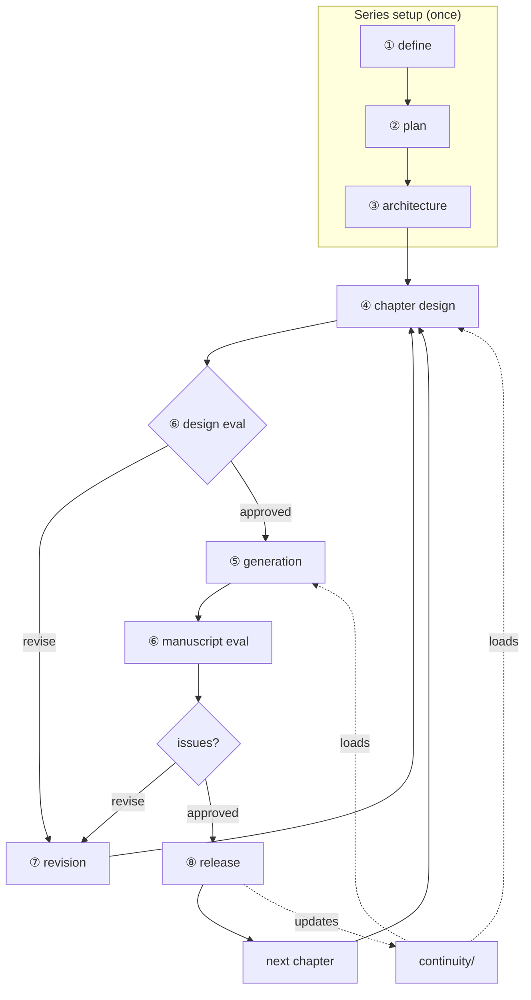

# Novel Authoring — Long-Form Fiction Generation Skill

Produces **complete narrative fiction** — from a single short story to a multi-volume epic — through a structured, stage-gated pipeline. Each stage produces artifact files; each requires **explicit user approval** before proceeding.

**Publication unit:** **Chapter.** Episodes/scenes are design-only sections inside that chapter's design file (④ must be manuscript-ready before ⑤).

**Setup:** ① lock Structure Mode + chapter-scale plan → ② `series.md` → ③ architecture → chapter loop ④→⑥→⑤→⑥→⑧. Layer sync: [`consistency.md`](workflow/consistency.md).

---

## How to Use This Skill

**This file (`SKILL.md`)** — always loaded. Contains pipeline rules, chapter loop, approval gates, and global constraints. **Read on every session** when working on a novel.

**Workflow files (`workflow/`)** — read **at the start of each stage** for step-by-step procedure, templates, and checklists. Re-read when resuming that stage.

| Stage | Purpose | Workflow | Gate artifact |
|-------|---------|----------|---------------|
| ① define | Lock scope, genre, criteria; **chapter-scale planning only** | [`01-define.md`](workflow/01-define.md) | `overview.md` |
| ② plan | Series blueprint — **short:** parts + chapter lists in `series.md`; **series:** Part Catalog only | [`02-plan.md`](workflow/02-plan.md) | `series.md` |
| ③ architecture | Characters, locations, world, chapter catalogs; **series mode:** `parts/` chapter lists | [`03-architecture.md`](workflow/03-architecture.md) | `characters.md`, `locations.md`, `world-bible.md`, `chapters/` (+ `parts/` if series) |
| ④ chapter design | Chapter design — episode/scene sections in one file | [`04-chapter-design.md`](workflow/04-chapter-design.md) | `chapters/{nnn}-{chapter-slug}.md` |
| ⑤ generation | Chapter prose locked to design + architecture + continuity | [`05-generation.md`](workflow/05-generation.md) | `manuscripts/{nnn}-{chapter-slug}.md` |
| ⑥ evaluation | Design and/or manuscript validation + critique | [`06-evaluation.md`](workflow/06-evaluation.md) | `evaluations/{nnn}-{chapter-slug}.md` |
| ⑦ revision | Design-first fixes + consistency cascade | [`07-revision.md`](workflow/07-revision.md) | Updated design/manuscript (+ higher files if needed) |
| ⑧ release | Lock chapter; update continuity | [`08-release.md`](workflow/08-release.md) | Continuity files |
| (any) | Optional research | [`research.md`](workflow/research.md) | `docs/{topic}.md` |
| (any) | **Consistency cascade** when any approved layer changes | [`consistency.md`](workflow/consistency.md) | Updated higher→lower files + re-run gates |

### Default Chapter Loop

Unless the user explicitly requests batching:

```
④ design chapter N (single chapter.md with episode sections) → user approves
  → ⑥ evaluate design (recommended) → user selects revisions
    → ⑦ revise design (if needed) → user approves
      → ⑤ write chapter manuscript → user approves
        → ⑥ evaluate manuscript → user selects revisions
          → ⑦ revise (if needed) → user approves
            → ⑧ release + update continuity
              → ④ design chapter N+1 → ...
```


```mermaid
graph TD
    subgraph setup ["Series setup (once)"]
        A["① define"] --> B["② plan"]
        B --> C["③ architecture"]
    end
    C --> D["④ chapter design"]
    D --> E{"⑥ design eval"}
    E -->|"revise"| F["⑦ revision"]
    F --> D
    E -->|"approved"| G["⑤ generation"]
    G --> H["⑥ manuscript eval"]
    H --> I{"issues?"}
    I -->|"revise"| F
    I -->|"approved"| J["⑧ release"]
    J --> K["next chapter"]
    K --> D
    J -.->|"updates"| CONT["continuity/"]
    CONT -.->|"loads"| D
    CONT -.->|"loads"| G
```

**Hard rules:**
- Do not start chapter N+1 until chapter N is **released** (⑧ complete)
- Every artifact requires **explicit user approval** before proceeding
- **Design evaluation before manuscript** is strongly recommended — fixing structure at design stage is more efficient than revising prose
- Batching and design-ahead are **opt-in only** — each chapter still needs individual approval before its manuscript

### Approval Applies To

- `overview.md`, `series.md`, architecture files
- Each `chapters/{nnn}-{chapter-slug}.md` (includes episode/scene design sections)
- Each `manuscripts/{nnn}-{chapter-slug}.md`
- Each `evaluations/{nnn}-{chapter-slug}.md` and revision decisions
- Release confirmation (stage ⑧)
- Any new character, location, or world rule (architecture update first, then cascade)
- Consistency Cascade file set when a higher layer changes ([`consistency.md`](workflow/consistency.md))

### Design-Ahead (Opt-In)

Only when the user requests designing multiple chapters before writing manuscripts:

- Each chapter design loads continuity as of the last **released** chapter
- Each design requires individual approval before its manuscript
- Earlier designs may be revised after later ones reveal conflicts — use [`consistency.md`](consistency.md) cascade; do not leave sibling chapter designs disagreeing with the Chapter List source

### Agent Procedure

1. **State the current stage** (e.g., *"Stage ④ — chapter design."*)
2. **Read the workflow file** for that stage before producing artifacts
3. **Write artifacts to files** — never leave deliverables in chat only
4. **Present and wait** for explicit user approval before advancing
5. After ⑧ release → continuity briefing → `04-chapter-design.md` for next chapter
6. On mid-flight changes → [`consistency.md`](workflow/consistency.md) cascade before continuing

---

## Structure & Artifacts

**Plot hierarchy:** `Series → Part → Chapter → Episode (design) → Scene (design)`

- **Chapter** = publication / manuscript unit
- **Episode / Scene** = design-only sections inside `chapters/{nnn}-{slug}.md` (④) — no nested episode folders for new work
- **Consistency across layers:** see [`consistency.md`](workflow/consistency.md) (source-of-truth stack + cascade on change)

### Structure Mode

| Mode | Guideline | `series.md` (②) | `parts/` |
|------|-----------|-----------------|---------|
| **Short** | ~1 volume, under ~20 chapters | Part Composition + **Chapter List** | Do not create |
| **Series** | Multi-part / long-form | Part Catalog only (no chapter rows) | Required (③ Chapter Lists) |

Lock Mode in `overview.md`. Episode count is decided only at ④.

### Files by stage

| Level | Artifact | Stage |
|-------|----------|-------|
| Constraints | `overview.md` | ① |
| Series | `series.md` | ② |
| Part | short: in `series.md`; series: `parts/` | ② / ③ |
| Chapter catalog → design | `chapters/{nnn}-{slug}.md` | ③ thin → ④ full |
| Prose | `manuscripts/{nnn}-{slug}.md` | ⑤ |
| Continuity | `continuity/*` | ⑧ write; ④/⑤/⑥ load |
| Evaluation | `evaluations/{nnn}-{slug}.md` | ⑥–⑧ |

**Gate order:** Short: ② (Chapter List) → ③ catalogs + world/cast → ④ designs. Series: ② Part Catalog → ③ `parts/` + catalogs → ④.

**Always:** Before ④ run Prior-Design Consistency; before ⑤ run Design-Fidelity; on any correction run the [cascade](workflow/consistency.md). Detail procedures stay in stage workflows — do not invent parallel rules in chat.

## Resolve Project Root

Before writing artifacts, resolve **`{project-root}`** — the folder that holds this novel.

Workspace layouts fall into three types. **Inspect the workspace first**, then match:

| Type | When | `{project-root}` |
|------|------|------------------|
| **1** | Workspace *is* the single novel project | `.` (workspace root) |
| **2** | Workspace holds multiple peer projects | `{title-slug}/` |
| **3** | Workspace groups projects by kind | `novels/{title-slug}/` |

**Examples:**
- Type 1 → `overview.md` at workspace root
- Type 2 → `{title-slug}/overview.md`
- Type 3 → `novels/{title-slug}/overview.md`

**Rules:**
1. Infer the type from existing structure (e.g. `overview.md` at root, peer project folders, or a `novels/` kind folder). Prefer an **existing** matching folder over creating a new one.
2. **Before creating** a new project folder, confirm **location and name** with the user.
3. If the project folder already exists, use it — do not recreate or relocate silently.
4. **`{title-slug}`:** URL-friendly slug from the novel title. Type 1 has no slug folder.

## Working Location

All artifacts under `{project-root}/`:

```
{project-root}/
├── overview.md              # ① (includes Structure Mode)
├── series.md                # ② short: parts + Chapter List; series: Part Catalog only
├── parts/                   # ③ series mode only — omit in short mode
│   ├── 001-{part-slug}.md
│   └── ...
├── chapters/                # ③ catalog / ④ design (one file per chapter)
│   ├── 001-{chapter-slug}.md   # chapter + Episodes + Scenes (Key Events)
│   └── ...
├── characters.md            # ③
├── characters/              # ③/④
├── locations.md             # ③
├── locations/               # ③/④
├── world-bible.md           # ③
├── world/                   # ③/④
├── docs/                    # optional
├── manuscripts/             # ⑤
│   ├── 001-{chapter-slug}.md
│   └── ...
├── continuity/              # ⑧ (loaded at ④/⑤)
├── evaluations/             # ⑥/⑦/⑧
│   ├── 001-{chapter-slug}.md
│   └── ...
└── ...
```

**Naming:** `{nnn}` = 001, 002, 003 … (always 3 digits) | `{slug}` = URL-friendly slug

Episode numbers are **local headings** inside the parent chapter file (`### Episode 001`). No nested `chapters/{slug}/` episode folder; no top-level `episodes/` directory.

---

## Dialogue Rules

1. State current stage; read that stage's workflow (+ [`consistency.md`](workflow/consistency.md) when changing shared lore/plot)
2. Stage ①: one question at a time; chapters only (never episode planning); lock Structure Mode
3. Present artifacts; wait for explicit approval; match user language
4. After release, prompt next chapter and wait
5. Propose design evaluation after ④; Reader-Editor (default) + Literary Critic for ch 001; Literary Awards Juror when user targets prestige
6. Critique → **design** → prose (never patch plot/structure in prose alone)
7. Honor Structure Mode; run load + Consistency/Fidelity gates at ④/⑤; on edits use Consistency Cascade and tell the user which files synced

---

## Prohibitions

**Structure / gates:**
- Episode planning at ①; episode counts in `series.md` / `parts/` / chapter catalogs
- Wrong Structure Mode layout (short with `parts/`; series with chapter rows in `series.md`)
- Treating chapter-count estimates as fixed contracts
- Nested `chapters/{slug}/` episode files; "Episode Detail" that duplicates Key Events
- ④ without Pre-Design Load / Consistency Gate; ⑤ without Pre-Generation Load / Design-Fidelity Gate
- Manuscript or Index-only design that skipped Manuscript Readiness
- Chapter N+1 before N released (unless user batches); skipping user approval; chat-only artifacts
- Publishing/evaluating at episode level; unlocking released chapters without explicit republication

**Consistency (see `consistency.md`):**
- Inventing cast/places/world rules in ④/⑤
- Changing a lower artifact that contradicts a higher one without cascade + approval
- Patching plot/structure in manuscript without updating chapter design first
- Ignoring continuity on ch 002+

**Craft:** Over-seeding ch 001; Hold in manuscript; info-dump / catalog world-building; opening without Opening Question; >2 POV inserts/episode without design; thematic closing monologue; cartoon villains; over-labeled POV emotion; quoted dialogue in Key Events

---

## Completion Criteria

**Per chapter:** ③ architecture (chapter catalog) → ④ design (single chapter.md: chapter + episodes + scenes) → ⑥ design evaluation → ⑤ manuscript → ⑥ manuscript evaluation → ⑦ revisions → ⑧ release + continuity updated

**Work complete:** Chapter List source complete (`series.md` in short mode; all `parts/` in series mode) → all chapters designed and released → user final approval
