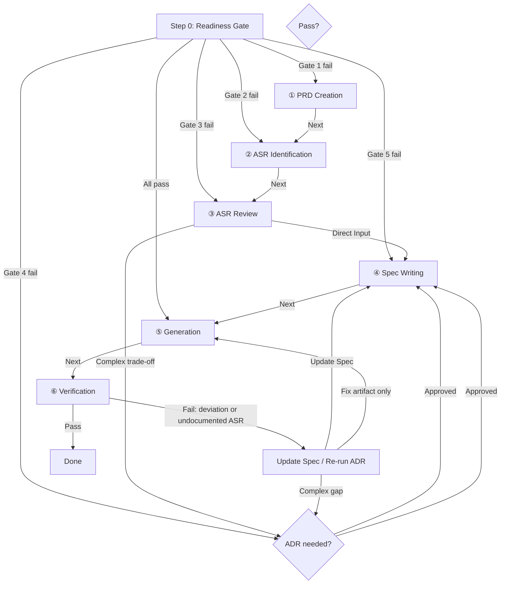

# Spec-Driven Generation — Unified Artifact Production Skill

This skill **produces, specifies, and verifies final artifacts** from a structured pipeline. The Spec is the **sole source of truth** for what to build — not the original user prompt, not ADR files, and not assumptions the agent fills in silently.

Deliverables include **software, documents, images, presentations, blog series, reports**, and any other finished work the Spec describes.

## How to Use This Skill

**This file (`SKILL.md`)** — always loaded. Contains the pipeline, Step 0 (Readiness Gate), ASR framework, project layout, rules, and global constraints.

**Workflow files (`workflow/`)** — read **at the start of each stage** for step-by-step procedure, templates, and checklists. Re-read when resuming that stage.

| Step | Purpose | Workflow | Gate artifact |
|------|---------|----------|---------------|
| **① PRD Creation** | Define product scope, goals, constraints | [`01-prd-creation.md`](workflow/01-prd-creation.md) | `{project-root}/spec/PRD.md` |
| **② ASR Identification** | Discover and register Architecturally Significant Requirements | [`02-asr-identification.md`](workflow/02-asr-identification.md) | `{project-root}/spec/ASR.md` |
| **③ ASR Review → ADR** | Review ASRs, route to Direct Input or ADR analysis | [`03-asr-review.md`](workflow/03-asr-review.md) | `{project-root}/adr/{concern-slug}.md` |
| **④ Spec Writing** | Consolidate decisions into self-contained Spec documents | [`04-spec-writing.md`](workflow/04-spec-writing.md) | `{project-root}/spec/{requirement-slug}.md` |
| **⑤ Generation** | Produce artifact strictly from Spec | [`05-generation.md`](workflow/05-generation.md) | Generated artifact(s) |
| **⑥ Verification** | Check artifact against Spec; find undocumented ASRs | [`06-verification.md`](workflow/06-verification.md) | `{project-root}/verification/{requirement-slug}.md` |

### Pipeline Flow



**Forward path after entry:** ① → ② → ③ → (ADR if needed) → ④ → ⑤ → ⑥

**Post-verification loop:** ⑥ fail → update Spec or run ADR → re-generate (⑤) → re-verify (⑥)

---

## Resolve Project Root

Before writing any files, resolve **`{project-root}`** — the folder that holds this deliverable.

Workspace layouts fall into three types. **Inspect the workspace first**, then match:

| Type | When | `{project-root}` |
|------|------|------------------|
| **1** | Workspace *is* the single project | `.` (workspace root) |
| **2** | Workspace holds multiple peer projects | `{project-slug}/` |
| **3** | Workspace groups projects by kind | `{kind}/{project-slug}/` (e.g. `apps/{project-slug}/`) |

**Rules:**
1. Infer the type from existing structure (e.g. `spec/` at root, peer project folders, or kind folders such as `apps/`, `services/`). Prefer an **existing** matching folder over creating a new one.
2. **Before creating** a new project folder, confirm **location and name** with the user.
3. If the project folder already exists, use it — do not recreate or relocate silently.
4. **`{project-slug}`:** English **kebab-case** (e.g. `jsondb`, `item-catalog-api`). Derive from the product or deliverable name; confirm if ambiguous. Type 1 has no slug folder.

---

## Project Folder Layout

All Spec / ADR / verification work for a deliverable lives under **`{project-root}`**:

```
{project-root}/
├── spec/
│   ├── ASR.md
│   ├── PRD.md
│   └── {requirement-slug}.md
├── adr/
│   └── {concern-slug}.md
├── verification/
│   └── {requirement-slug}.md
└── … (generated artifacts and other project files)
```

- **`{project-root}/spec/ASR.md`:** Living registry of Architecturally Significant Requirements. Maintained by this skill (updated during Steps 2–4 and 6). **Not** a generation Spec — exclude when loading Spec content for production.
- **`{project-root}/spec/PRD.md`:** Product anchor — high-level scope, goals, global constraints.
- **`{project-root}/spec/{requirement-slug}.md`:** Modular, self-contained Spec for one deliverable or requirement scope. **Sole input** for generation (⑤) and verification (⑥).
- **`{project-root}/adr/`:** Architecture Decision Records — decision audit trail, not required reading for generation.
- **`{project-root}/verification/`:** Verification reports — one per Spec.
- Place `spec/`, `adr/`, and `verification/` under `{project-root}` only. Keep `ASR.md` only at `{project-root}/spec/ASR.md`.

---

## Core Principle: Spec as Quality Contract

The Spec exists to capture every **ASR (Architecturally Significant Requirement)** — requirements and design decisions that **materially affect the structure, organization, or quality of the final deliverable**. Optimal generation requires the Spec to encode:

- **What** to produce — scope, format, audience, output location
- **How** it is organized — structure, composition, narrative or functional layout
- **What bar** applies — constraints, acceptance criteria, explicit quality expectations
- **What is excluded** — out-of-scope items that would otherwise be guessed at

Unstated ASRs force silent defaults — and defaults degrade quality. **Step 0** exists to surface those choices **before** generation, not to document them after the fact.

### ASR vs ADR vs Spec vs Generation vs Verification

| | ASR (`ASR.md`) | ADR | Spec | Generation (⑤) | Verification (⑥) |
|---|-----|------|------|-------------------------|---------------------------|
| **Unit** | One architecturally significant requirement | One concern (one question) | One deliverable or requirement scope | One or more artifacts per Spec | One or more artifacts per Spec |
| **Purpose** | Track what must be decided and its lifecycle | Compare alternatives; record approval | State decided requirements self-contained | **Produce** the artifact | **Confirm** the artifact matches the Spec |
| **Reader needs** | Know what is open, reviewing, designed, or approved | Understand options and tradeoffs | Understand what to build | Receive the finished work | Know what passed, failed, or was decided |
| **Role in pipeline** | Decision backlog & status board | Design review for open ASRs | **Sole input** for generation & verification | Execution | Audit |

### ASR ↔ ADR cardinality (many-to-many)

- **One ASR → many ADRs:** A single ASR may require several design reviews (e.g. *Storage Model* → partitioning ADR + indexing ADR + consistency ADR).
- **One ADR → many ASRs:** A single ADR may resolve or partially address multiple related ASRs when the concern spans them.
- Always record both sides: list Related ADRs on each ASR in `ASR.md`, and list Related ASRs on each ADR file.

---

## ASR — Architecturally Significant Requirements

An **ASR** is a requirement or design decision that materially affects the structure, organization, or quality of the final deliverable. When an ASR is unstated, generation fills the gap with a silent default. Use this framework during **Step 0** when gates fail or Specs have material gaps.

**Every identified ASR must be registered in `{project-root}/spec/ASR.md`.** Do not keep ASRs only in conversation memory.

### Universal ASR categories (always consider)

| ASR category | What to surface | Examples across artifact types |
|--------------|-----------------|--------------------------------|
| **Purpose & audience** | Who is this for? What job does it do? | API consumers; report readers; presentation attendees; image viewers |
| **Deliverable form** | Artifact type(s), format, and output location | Go module; markdown report; slide deck; PNG; multi-file series |
| **Scope boundary** | What is in vs out? | MVP endpoints only; executive summary not appendices |
| **Quality bar** | What does "done" and "good enough" mean? | Test coverage; citation depth; visual fidelity; word count |
| **Constraints** | Hard limits generation must respect | Language, deadlines, brand guidelines, dependencies, budget |
| **Structure & organization** | How is content or function arranged? | API layers; document sections; episode order; slide narrative |
| **Integration & dependencies** | What must this connect to or build on? | Existing codebase; prior episodes; corporate template |
| **Process & staging** | Approval gates or iterative delivery? | Draft-review-publish; staged image approval |

### ASR Lifecycle Status

Track each ASR in `ASR.md` with exactly one status:

| Status | Meaning |
|--------|---------|
| `identified` | Discovered and registered; not yet under active review |
| `reviewing` | Under discussion — Direct Input or one or more ADRs in progress |
| `designed` | Solution chosen (via Direct Input and/or approved ADR(s)); Spec sync may still be pending |
| `approved` | User confirmed; outcomes encoded in Spec; blocking work for this ASR is done |
| `deferred` | Intentionally postponed; non-blocking for the current generation scope |

Status transitions: `identified` → `reviewing` → `designed` → `approved`. Use `deferred` only with explicit user agreement.

### ASR Decision Pathways (Based on User Context)

When evaluating open ASRs (Step ③), do not force an ADR for every single concern. Match the user's domain expertise and context:

1. **Direct Input Route (High Context):** If the problem is straightforward, has a natural default, or the user has clear preferences, ask direct questions. Let them dictate the choice, update `ASR.md` to `designed` (fill **Resolution**), then proceed — Spec sync is **Step ④**.
2. **ADR Analysis Route (Low Context / Complex Trade-offs):** If the user is unsure of the solution, or if the problem involves complex architectural trade-offs (e.g., competing tech stacks, structural patterns), set the ASR to `reviewing` and trigger **`adr-writing`**. Link every new ADR back to the relevant ASR ID(s). Multiple ADRs may be opened for one ASR; one ADR may cover multiple ASRs. After user approval → **Step ④** (do not invent approval).

### Multi-Spec & Multi-ASR Strategy

In large-scale projects, specifications must be broken down into multiple, **independent spec files** based on domain or component boundaries to maintain clarity and modularity.

When dealing with a complex, multi-spec environment, do not focus on the generation or writing order of the files themselves. Instead, **focus on the structural dependencies between ASRs**, tracked in `{project-root}/spec/ASR.md`:

1. **Map ASR Dependencies:** Analyze which foundational decisions must happen first (e.g., *Storage Model* must be decided before *API Surface*, which must be decided before *Client UI*). Record the order under **Dependency Order** in `ASR.md`.
2. **Sequential Review Path:** Present a recommended, step-by-step evaluation path to the user based on these ASR dependencies. Guide the user to review and resolve one ASR at a time; open ADRs as needed (many-to-many).
3. **Delegation to Spec Writing:** The actual formatting and markdown documentation of independent specs are handled in **Step ④ (Spec Writing)**; keep ASR statuses current in `ASR.md` throughout.

---

## Step 0. Spec Readiness Gate

**Always start here.** Resolve `{project-root}` first (inspect workspace type; confirm slug/location if creating). If `{project-root}` is missing and is not the workspace root (Type 2/3), create it after user confirmation (and `spec/`) before evaluating gates that require files.

Evaluate gates **in order**; stop at the **first** failure and jump there. Do not re-run this gate sequence after each subsequent step.

| Gate | Check | Pass criteria | On fail |
|------|-------|---------------|---------|
| **Gate 1** | PRD approved? | `{project-root}/spec/PRD.md` exists and the user has explicitly approved it | → **Step ①** |
| **Gate 2** | ASRs identified for the PRD? | Blocking ASRs from the PRD, user context, and universal categories are registered in `ASR.md` (at least `identified`); **Dependency Order** is filled | → **Step ②** |
| **Gate 3** | ASRs all reviewed? | No blocking ASR remains `identified` (each is `reviewing` or beyond, or explicitly `deferred`) | → **Step ③** |
| **Gate 4** | ADRs all approved? | Every ADR linked from blocking ASRs is `approved` (or the ASR used Direct Input with no open ADR). No Related ADR remains `proposed` | → Pause for user ADR approval via `adr-writing` (do **not** invent approval). When approved → **Step ④** |
| **Gate 5** | Spec created? | Requirement Specs (`PRD.md` + needed `{requirement-slug}.md`, not `ASR.md`) encode approved resolutions and are **sufficient** for the deliverables in the PRD | → **Step ④** |

**All gates pass → Step ⑤.**

Do not rely on rigid ASR counts; assess fitness for purpose.

### Post-Generation Defect Loop

If verification fails (⑥), or the user finds quality issues after generation, **never patch the artifact directly**:

1. **Root Cause:** Register or reopen the ASR in `ASR.md`.
2. **Re-enter Step 0** once to resume at the correct remediation step (then advance forward through ①–⑥ as needed).
3. **Regenerate:** Complete through ⑤ against the updated Spec only.

---

## Agent Procedure

1. **State the current step** (e.g., *"Step ② — ASR Identification."*)
2. **Read the workflow file** for that step before producing artifacts
3. **Write artifacts to files** — never leave deliverables in chat only
4. **Present and wait** for explicit user approval before advancing
5. After Step ⑥ (verification) → if pass, done; if fail, loop via Step 0
6. On mid-flight changes → update ASR.md / Spec before continuing

---

## Dialogue Rules

1. **State the Current Step:** Tell the user the step and cite the ASR ID from `ASR.md` when relevant.
2. **Reduce User Fatigue:** When asking about open ASRs, always propose a recommended default or best-practice option based on project context (e.g., *"We recommend X because of Y. Shall we proceed with this, or do you have another preference?"*). Do not ask open-ended questions without guidance.
3. **One Question at a Time:** Focus on one ASR (or one dependency branch) at a time to keep the conversation structured.
4. **Immediate Documentation:** Update `ASR.md` as statuses change; sync Spec in Step ④ before advancing to Step ⑤.
5. **Handle Verification Feedback Loop:** If the user arrives with a verification report (⑥), focus the dialogue strictly on deciding whether to update the Spec contract or force an artifact fix.
6. Match the user's language (Korean, English, etc.) in user-facing messages. Artifact content follows the language implied by the Spec unless the Spec states otherwise.

---

## Prohibitions

- Generating final artifacts while any Step 0 gate still fails.
- Generating final artifacts **without** a ready Spec when blocking decisions remain unresolved.
- Identifying ASRs in conversation only — without registering them in `{project-root}/spec/ASR.md`.
- Leaving ASR status stale after Direct Input, ADR open/approve, or Spec sync.
- Writing Spec / ADR / verification files outside `{project-root}` (including placing `ASR.md` outside `{project-root}/spec/`).
- Skipping resolve/create of `{project-root}` when it does not yet exist on a generation request.
- Reading **`{project-root}/adr/`** files as a substitute for Spec content during generation or verification.
- Treating the original prompt as authoritative when it **contradicts** the Spec.
- Adding requirements, features, or scope not explicitly stated or implied by the Spec.
- Patching or editing generated artifacts directly without updating `{project-root}/spec/PRD.md` or `{project-root}/spec/*.md` first during a defect loop.
- Asking a flat checklist of open questions without providing recommendations or considering ASR dependencies.
- Silently merging conflicting Specs.
- Verifying against conversation history or ADR files instead of the Spec.
- Cursory or summary-only verification without item-by-item artifact evidence.
- Ignoring Out of Scope violations or treating undocumented ASRs as automatically approved.
- Applying artifact fixes silently before the user has reviewed the verification report.
- Spec bullets that point to `{project-root}/adr/` or conversation history instead of stating the specification fully.
- Handing off to generation with ADR files marked as required reading.
- Adding `Status`, `Approved`, or other lifecycle approval state fields in Spec files.
- Bundling multiple independent deliverables into a single Spec document.

---

## Completion Criteria

- **Step 0** used once at entry (or defect resume): first failing gate selected; then Steps advance forward without re-gating.
- PRD approved → ASRs identified → blocking ASRs reviewed → linked ADRs approved (or Direct Input) → Specs synced → generation → verification (①–⑥).
- `{project-root}` resolved (and created after confirmation when needed); `PRD.md` and `ASR.md` maintained; Related ADR ↔ ASR links bidirectional.
- Deliverable produced at agreed paths strictly following Spec **Requirements**, **Decisions**, and **Constraints** (⑤).
- Verification report saved, deviations and undocumented ASRs categorized, and user offered the reverse traceability loop (⑥).
