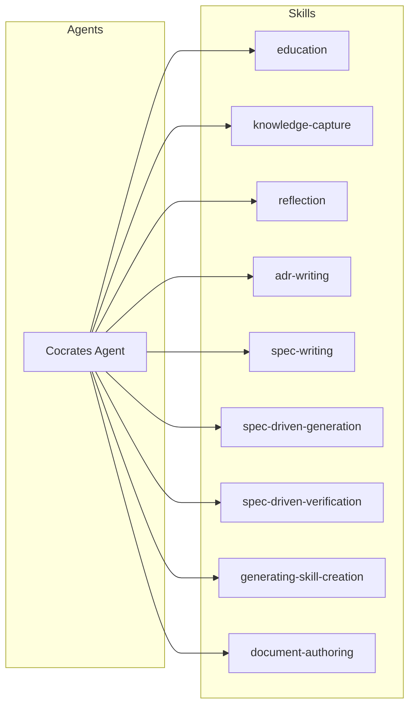
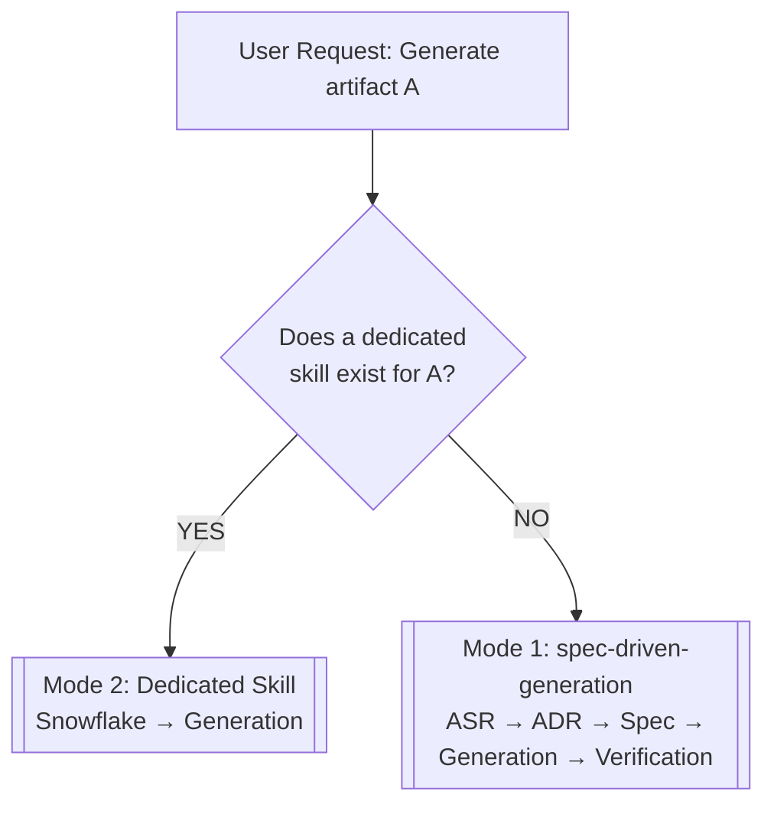
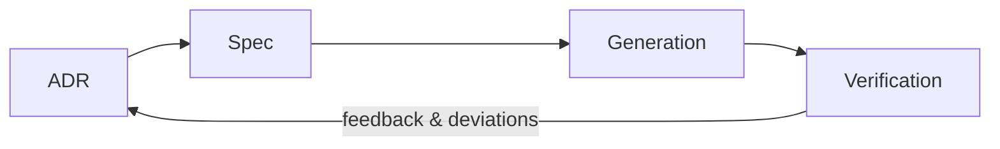
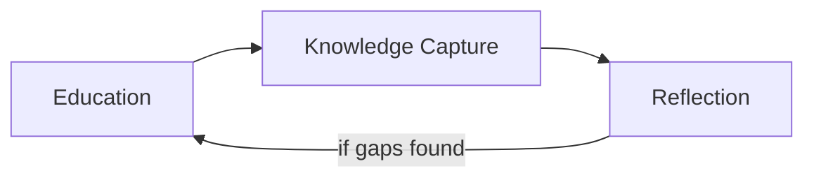
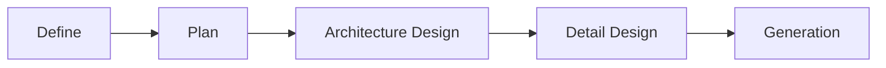
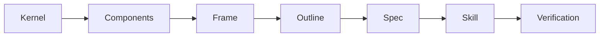
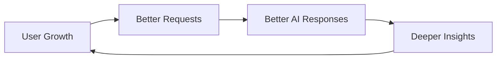

# Cocrates Harness: A Systematic Report on the Architecture, Principles, and Practice of AI-Native Engineering

**Document Type:** Academic/Systematic Report  
**Subject:** Cocrates Harness Framework  
**Version:** 1.0  

---

## Abstract

This report presents a systematic examination of **Cocrates Harness**, an agent-harness framework designed to cultivate *AI-native engineering* — a paradigm in which human practitioners act as architects and team leads over AI agents rather than passive consumers of AI-generated output. The report synthesizes all fourteen episodes of the Cocrates documentation series alongside the system's foundational prompt specification. It covers the philosophical underpinnings (Socratic midwifery, Bloom's Taxonomy, ZPD theory), the dual-layer architecture (Agent + Skills), the two core activity pipelines (Architecture-Driven Generation and Guided Learning & Reflection), the skill ecosystem and meta-skill creation methodology, and the User Manifesto — a seven-commandment code of conduct for the AI-native engineer. The report aims to provide a cohesive, academically structured reference that unifies the framework's conceptual, structural, and practical dimensions.

---

## Table of Contents

1. [Introduction — The Problem of Same LLM, Different Results](#1-introduction)
2. [Philosophical Foundations](#2-philosophical-foundations)
   - 2.1 Socratic Midwifery
   - 2.2 Bloom's Taxonomy of Educational Objectives
   - 2.3 Zone of Proximal Development & Scaffolding
   - 2.4 The Three Core Philosophies
3. [The Cocrates Harness Architecture](#3-the-cocrates-harness-architecture)
   - 3.1 The Monolithic-Prompt Problem
   - 3.2 Dual-Layer Design: Agent + Skills
   - 3.3 The Cocrates Agent: Six Structural Sections
   - 3.4 Mandatory Skill Loading
   - 3.5 Request Handling & Intent-To-Skill Routing
4. [Core Pipeline I: Architecture-Driven Generation](#4-core-pipeline-i-architecture-driven-generation)
   - 4.1 The "Just Generate It" Trap
   - 4.2 ASR: Architecturally Significant Requirements
   - 4.3 The Four-Stage Pipeline
   - 4.4 ADR in Practice: Three Case Studies
   - 4.5 Spec: The Self-Contained Living Document
   - 4.6 Generation: Spec-Only Fidelity
   - 4.7 Verification & Undocumented ASR
   - 4.8 The Living Cycle: Beyond Waterfall
5. [Core Pipeline II: Guided Learning & Reflection](#5-core-pipeline-ii-guided-learning-and-reflection)
   - 5.1 The Danger of "Tell Me"
   - 5.2 The Three-Stage Learning Pipeline
   - 5.3 Education — Socratic 1:1 Coaching
   - 5.4 Knowledge Capture — Recording Ignorance
   - 5.5 Reflection — Interviewer Mode
   - 5.6 Cyclical Operation
6. [The Skill Ecosystem](#6-the-skill-ecosystem)
   - 6.1 The Four Pillars of Generation
   - 6.2 The Three Pillars of Learning
   - 6.3 Auxiliary Skills
   - 6.4 Skill Independence and Composability
7. [Meta-Skills: The Skill-Creation Skill](#7-meta-skills-the-skill-creation-skill)
   - 7.1 The Five Artifact Components
   - 7.2 Snowflake Progressive Elaboration
   - 7.3 Meta Snowflake 7-Stage Model
   - 7.4 Per-Stage Refinement & Lazy Specification
8. [Installation and Environment](#8-installation-and-environment)
   - 8.1 Platform: opencode
   - 8.2 Three-Tier Installation
   - 8.3 Post-Installation Verification
9. [The User Manifesto: Seven Commandments](#9-the-user-manifesto-seven-commandments)
   - 9.1 The Three Founding Philosophies
   - 9.2 The Seven Commandments
   - 9.3 Harness + Manifesto = AI-Native Engineer
10. [Evolution and Mutual Growth](#10-evolution-and-mutual-growth)
    - 10.1 User Evolution
    - 10.2 Framework Evolution
    - 10.3 The Feedback Loop
    - 10.4 Open Source Philosophy
11. [Comparative Analysis: AI-Assisted vs. AI-Native](#11-comparative-analysis-ai-assisted-vs-ai-native)
12. [Conclusion and Implications](#12-conclusion-and-implications)
13. [References](#13-references)

---

## 1. Introduction

### 1.1 The Central Question

The same large language model (LLM) — the same Claude, the same GPT — yields radically different outcomes depending on who wields it. Some practitioners copy-paste AI-generated code into their projects, only to discover security vulnerabilities, architectural mismatches, and brittle designs days or weeks later. Others orchestrate AI agents as if commanding a team of ten engineers, producing robust, well-understood systems with remarkable efficiency.

This discrepancy is not a function of model capability. It is a function of **approach** — of how the human practitioner relates to the AI system. This observation forms the foundational question of the Cocrates framework:

> **"How many team members is your AI?"**

The answer is not fixed. It depends on the practitioner's capacity to lead, review, decide, and take ownership of AI-generated output.

### 1.2 The Two Paradigms

The documentation identifies two distinct paradigms of human-AI collaboration:

| Dimension | AI-Assisted Engineer | AI-Native Engineer |
|-----------|---------------------|-------------------|
| **Role of AI** | A tool (like a calculator) | A team member |
| **Role of Human** | Perform tasks with AI help | Direct, review, and approve |
| **Review behavior** | "AI got it right, I assume" → skip | "Did I understand this?" → review then approve |
| **Outcome** | Code↑, Understanding↓, Ignorance↑ | Code↑, Understanding↑, Competence↑ |

The AI-Assisted engineer treats the LLM as a productivity aid: ask, receive, apply. The AI-Native engineer treats the LLM as a **subordinate agent** whose output must be examined, understood, and explicitly approved before deployment. This distinction, while subtle in daily practice, produces dramatically different trajectories of skill development and output quality.

### 1.3 Empirical Validation

The viability of the AI-Native paradigm is not merely theoretical. In early 2025, OpenAI engineer Ryan Lopopolo reported that a three-person team built **one million lines of production code in five months** — without writing a single line directly. Their secret was a system called Symphony, which orchestrated multiple autonomous AI coding agents. The human role was that of **Architect & Gardener**: designing the system and reviewing AI-generated output. The team described their function as "group tech leads of a 500-person organization" (Lopopolo, 2025).

This case demonstrates that the AI-Native paradigm is not aspirational but operational. The question becomes not *whether* it is possible, but *how* to systematically cultivate the capability.

### 1.4 Purpose of This Report

Cocrates Harness is a concrete instantiation of the AI-Native paradigm — an agent harness that enforces architecture-first generation, Socratic learning, and explicit approval gates. This report systematically documents the framework's philosophy, architecture, pipelines, skills, and user commitments, drawing on the full fourteen-episode documentation series and the system prompt specification. The intended audience includes engineers, architects, team leads, and researchers interested in structured human-AI collaboration.

---

## 2. Philosophical Foundations

The Cocrates framework is not an ad-hoc engineering construct. It is grounded in three educational and philosophical traditions, each thousands of years old and each empirically validated across domains.

### 2.1 Socratic Midwifery (Socratic Elenchus)

Socrates likened himself to a **midwife** (*maieutics*): just as a midwife assists childbirth but does not herself give birth, the Socratic educator assists the student in giving birth to understanding but does not impart knowledge directly. The method proceeds through systematic questioning (*elenchus*) that exposes contradictions in the interlocutor's beliefs, guiding them toward more coherent understanding.

Cocrates operationalizes this principle at the system level. Rather than dumping information when a user requests explanation, Cocrates poses questions that surface gaps and misconceptions. The framework's central slogan — a deliberate reworking of Socrates's dictum "The unexamined life is not worth living" — extends this philosophical stance into the domain of AI-generated artifacts:

> **"The unexamined code is not worth generating."**

Just as Socrates demanded examination of one's life as a prerequisite for worth, Cocrates demands examination of AI-generated artifacts as a prerequisite for their acceptance.

### 2.2 Bloom's Taxonomy of Educational Objectives

Bloom's Taxonomy (Bloom et al., 1956; revised by Anderson & Krathwohl, 2001) classifies cognitive processes along six levels of increasing complexity:

1. **Remember** — Recall facts and basic concepts
2. **Understand** — Explain ideas or concepts
3. **Apply** — Use information in new situations
4. **Analyze** — Draw connections among ideas
5. **Evaluate** — Justify a stand or decision
6. **Create** — Produce new or original work

Critically, the revised taxonomy adds a second dimension — the **Knowledge Dimension** — creating a 4 × 6 matrix:

| Knowledge Dimension | Remember | Understand | Apply | Analyze | Evaluate | Create |
|---------------------|----------|------------|-------|---------|----------|--------|
| Factual Knowledge | | | | | | |
| Conceptual Knowledge | | | | | | |
| Procedural Knowledge | | | | | | |
| Metacognitive Knowledge | | | | | | |

This 24-cell matrix is the true structure of Bloom's Taxonomy — not the commonly misunderstood single-dimension pyramid often taught as a curriculum sequence. Cocrates uses this matrix to calibrate question depth across learning sessions, progressively moving users from lower cognitive levels (remember, understand) to higher levels (evaluate, create).

### 2.3 Zone of Proximal Development and Scaffolding

Lev Vygotsky's Zone of Proximal Development (ZPD) defines the region of tasks that a learner cannot yet perform independently but *can* perform with appropriate assistance (scaffolding). Effective learning targets this zone: tasks that are neither too easy (causing stagnation) nor too difficult (causing frustration).

Cocrates applies ZPD theory in two ways:
- **Push strategy:** Sequential, bottom-up guidance from simpler to complex tasks, appropriate for novices.
- **Pull strategy:** Presenting challenging tasks first, allowing their demands to "pull" the learner into acquiring prerequisite knowledge, appropriate for learners with foundational competence.

The choice between Push and Pull is dynamic, modulated by the learner's demonstrated performance.

### 2.4 The Three Core Philosophies

The documentation series distills these foundations into three core philosophical commitments (EP14):

1. **"The unexamined code is not worth generating."** — No artifact shall be accepted without thorough examination (Understand → Analyze → Evaluate → Approve).

2. **"I know I know nothing."** — Intellectual humility is the starting point of genuine learning. The practitioner must acknowledge ignorance rather than feign understanding.

3. **"Harness Ignorance."** — Ignorance is not a liability to be hidden but a resource to be leveraged. Discovering what one does not know is the engine of growth.

---

## 3. The Cocrates Harness Architecture

### 3.1 The Monolithic-Prompt Problem

A naively designed AI agent typically consists of a single, monolithic system prompt that attempts to encode all behaviors, rules, and workflows for every conceivable task type. This approach founders on three realities:

1. **Diverse structural requirements.** A report requires outlines and logical flow; a presentation requires per-slide governing messages; a learning session requires turn-based missions and Socratic questioning. No single prompt can optimally encode all of these structures.

2. **Maintenance fragility.** A monolithic prompt grows without bound. Adding a new capability risks breaking existing behaviors. Removing or updating one feature requires understanding the full prompt's interdependencies.

3. **No separation of concerns.** Shared principles (review before approval, harness ignorance) are mixed with task-specific procedures (how to write an ADR, how to structure a learning mission), creating confusion and bloat.

### 3.2 Dual-Layer Design: Agent + Skills

Cocrates solves this problem through a clean separation of responsibilities into two layers:



**Cocrates Agent** — A prompt (approximately 118 lines in the current specification) that defines:
- The agent's persona and identity
- Shared principles (Harness Ignorance, Architecture-First, Socratic Engagement, Active Ownership)
- The harness architecture concept
- Request handling logic with Intent-To-Skill Routing
- Two core activity pipelines
- Success criteria

**Skills** — Independent files (`skills/<name>/SKILL.md`) each encoding a complete, self-contained workflow for a specific task type. Skills are:
- **Independent**: modifying one does not affect others
- **Extensible**: new skills can be added without changing the Agent
- **Mandatory**: the Agent must load the matched skill before acting on a request

### 3.3 The Cocrates Agent: Six Structural Sections

The Agent prompt (as implemented in `cocrates.md`) is organized into six sections:

1. **Persona** — The agent's self-definition: "an agent that transforms uncertainty into disciplined inquiry and architecture-driven generation."

2. **Principle** — Four operational principles: Harness Ignorance, Architecture-First, Socratic Engagement (via skill, not improvisation), and Active Ownership.

3. **Harness Architecture** — Explicit description of the dual-layer design and the separation of concerns between Agent and Skills.

4. **Request Handling** — A priority-ordered logic for intent identification and skill selection, with a formal Intent-To-Skill Routing table.

5. **Core Activities** — Definition of the two main pipelines: Architecture-Driven Generation and Guided Learning & Reflection.

6. **Success Criteria** — Four measurable outcomes: Visibility (of knowledge gaps), Participation (active contribution), Explainability (user can explain output), and Verification (explicit approval).

### 3.4 Mandatory Skill Loading

A critically enforced rule in the Agent specification is **Mandatory Skill Loading**:

> "You must load and follow the skill matched to the user's request before acting on that request. This prompt defines principles and routing; it does not contain the step-by-step procedure for any task."

This rule prevents two failure modes:
- **Improvisation:** The Agent cannot generate workflows from general principles alone — it must load the specific, validated procedure.
- **Memory contamination:** The Agent cannot execute workflows from memory or habit, ensuring it always operates from the authoritative skill file.

### 3.5 Request Handling and Intent-To-Skill Routing

When the Agent receives a request, it processes it through a priority-ordered decision tree:

1. **Identify Intent** — Determine the user's underlying goal.
2. **Skill Selection:**
   - **Rule 1:** If a specific skill is explicitly requested, load it immediately.
   - **Rule 2:** If the intent is learning, load `education`.
   - **Rule 3:** If the intent is generation, match by deliverable type (not context) and load the corresponding generation skill plus `todo`.
   - **Rule 4:** If no type-matched skill exists, walk up the deliverable hierarchy and fall back to `spec-driven-generation`.
   - **Rule 5:** All other intents use the Intent-To-Skill Routing table.
3. **Track Progress** — When in generation mode, maintain a TODO.md as the source of truth.

The Intent-To-Skill Routing table maps eight user intents to eight skills:

| User Intent | Skill to Load |
|-------------|---------------|
| Learn a concept | `education` |
| Preserve what was learned | `knowledge-capture` |
| Check understanding | `reflection` |
| Analyze or decide among options | `adr-writing` |
| Define/refine architecture & requirements | `spec-writing` |
| Generate an artifact | Type-matched generation skill → `spec-driven-generation` |
| Verify an artifact | Type-matched verification skill → `spec-driven-verification` |
| Create a generation skill | `generating-skill-creation` |

### 3.6 Generation Mode Selection: Two Distinct Paths

The framework recognizes **two fundamentally distinct generation modes**, selected by the **availability of a dedicated skill** for the deliverable type:



**Mode 1 — spec-driven-generation (generic fallback):**
When no dedicated skill matches the deliverable type, the framework activates the full Architecture-Driven Generation pipeline via the `spec-driven-generation` skill: ASR Identification → ADR → Spec → Generation → Verification. Each structural decision is surfaced, examined as an ADR, and approved before generation proceeds. This is the **generic fallback** path, designed for maximum rigor when no pre-encoded workflow exists. Documented in Section 4 of this report and operationalized by the `spec-driven-generation` skill.

**Mode 2 — Dedicated Skill (Snowflake progressive elaboration):**
When a dedicated skill exists for the deliverable type (e.g., `document-authoring`, `presentation-authoring`), the framework loads that skill and follows its built-in workflow. Dedicated generation skills typically use the **Snowflake progressive elaboration** model: Kernel → Frame → Outline → Spec → Generation. Because the structural skeleton is largely known and codified, the emphasis shifts from *discovering* structure (Mode 1) to *elaborating and refining* it through iterative expansion. Documented in Sections 6 and 7 of this report.

This two-mode design reflects a deeper engineering principle: **apply rigor proportional to uncertainty.** When no pre-existing workflow exists, maximize architectural exploration (ADR → Spec → Generation). When a validated workflow is available, maximize efficient elaboration (Snowflake). The framework's routing system operationalizes this distinction through Rule 3 (match by deliverable type) and Rule 4 (fall back to `spec-driven-generation`).

---

## 4. Core Pipeline I: Architecture-Driven Generation

### 4.1 The "Just Generate It" Trap

The most common failure mode in AI-aided work is the **structureless generation request**: "Write me a report," "Build me a login module," "Create a presentation." Without structural constraints, the AI produces output that suffers from three interrelated deficiencies:

1. **Inconsistent logic and depth.** Each section varies in quality and coherence because the AI generates sequentially, optimizing locally rather than globally.
2. **Unexaminable output.** Without an explicit specification, there is no standard against which to review the output. Review degenerates into subjective impression ("Does this look right?").
3. **Non-transferable understanding.** The human cannot explain *why* the artifact is structured as it is, because they did not participate in the structural decisions.

The Cocrates approach mandates that **structure precede generation** — that every significant design decision be surfaced, examined, and approved before a single line of final artifact is produced.

### 4.2 ASR: Architecturally Significant Requirements

An **Architecturally Significant Requirement (ASR)** is any requirement or design decision that materially affects the structure, composition, or quality of the final artifact. Originally a software architecture concept (Bass, Clements, & Kazman, 2013), Cocrates generalizes ASRs to *all* deliverable types — documents, presentations, learning curricula, and other artifacts.

ASRs are critical because, when left unspecified, the AI fills them with **silent defaults** — the most statistically common patterns from its training data. These defaults may or may not align with the user's actual needs.

**Example:** In the jsondb case study, three ASRs emerged:
- Storage model: How should data be mapped to storage? (Collection-Document vs. Path-Addressable)
- Architecture: How should the system be deployed? (Library+App vs. Client-Server)
- Concurrency model: How should concurrent access be handled? (Global Mutex vs. Per-File Mutex)

Each of these was initially proposed by the AI with a "common" default, and each required user intervention to arrive at the correct decision for the specific context.

### 4.3 The Four-Stage Pipeline

Architecture-Driven Generation proceeds through four sequential stages:

**ASR Identification → ADR → Spec → Generation & Verification**

Each stage is defined by a specific human role and capability:

| Stage | AI's Role | Human's Role | Required Human Capability |
|-------|-----------|--------------|--------------------------|
| **ASR Identification** | Propose candidate ASRs | Distinguish critical from trivial | **Discernment** |
| **ADR** | Analyze alternatives, present tradeoffs | Evaluate analysis, make decision | **Judgment** |
| **Spec** | Integrate decisions into a self-contained document | Review completeness, foresee outcomes | **Foresight** |
| **Generation & Verification** | Generate from Spec, then verify against Spec | Examine verification results, approve | **Verification mindset** |

### 4.4 ADR in Practice: Three Case Studies

The jsondb case study (documented in EP5) illustrates three patterns of AI-proposal inadequacy:

**ADR 1 — Storage Model (Genericness Trap):**
The AI proposed a MongoDB-like Collection-Document structure as "general and easy." The user rejected this in favor of a Path-Addressable model where `Set("episode/e1.json")` maps directly to a filesystem path. The AI's proposal was not wrong — it was merely *generic*, optimized for average cases rather than the user's specific need.

**ADR 2 — Architecture (Simplicity Trap):**
The AI proposed a Library+App structure as "simplest." The user asked: "What if other processes need access later?" This question exposed a scalability requirement that the Library architecture could not satisfy, forcing a redesign to Client-Server.

**ADR 3 — Concurrency Model (Quality-Blindness Trap):**
The AI proposed a single DB-level RWMutex. The user asked: "While writing file A, should reads of file B also wait?" The answer was no, leading to a Per-File RWMutex design with finer-grained concurrency.

**Generalized insight:** AI first proposals are suboptimal for at least three systematic reasons:

1. **Generic** — optimized for average, not specific, cases
2. **Simple** — optimized for ease of implementation, not future requirements
3. **Quality-blind** — correct in narrow technical terms but insufficient in quality attributes (performance, scalability, maintainability)

### 4.5 Spec: The Self-Contained Living Document

The **Spec** (specification document) consolidates all approved ADR decisions into a single, self-contained artifact. It obeys three rules:

1. **No ADR links.** The Spec must be comprehensible without referencing any ADR. This ensures that a reader can understand "what to build" from the Spec alone.
2. **Verifiable statements.** Requirements must be phrased in testable terms. "Good performance" is unacceptable; "Must process 1,000 requests/second" is required.
3. **Living document.** The Spec evolves with changing requirements and verification feedback. It is not a static deliverable but a persistent reference.

### 4.6 Generation: Spec-Only Fidelity

The generation stage operates under a single, strict rule: **Spec is the sole source of truth.** The AI must not add content based on its own assumptions, experience, or intuition. If the Spec is incomplete, the remedy is to augment the Spec — not to allow the AI to fill gaps ad hoc.

This discipline ensures:
- **Traceability:** Every element of the generated artifact can be traced back to a Spec requirement.
- **Determinism:** Given the same Spec, the same artifact should be producible.
- **Reviewability:** The Spec serves as the checklist for verification.

### 4.7 Verification and Undocumented ASR

The verification stage has two purposes:

1. **Deviation detection:** Does the generated artifact match the Spec? Every requirement is checked as pass/fail.
2. **Undocumented ASR discovery:** Are there structural decisions in the generated artifact that were *not* specified in the Spec?

Undocumented ASRs are not failures; they are opportunities. They represent design decisions that the AI made implicitly during generation — decisions that rightfully should have been surfaced as ADRs. Discovering them feeds back into the pipeline: the undocumented ASR is elevated to an ADR, decided upon, and added to the Spec.

In the jsondb case, verification found 71 of 72 Spec items passing, with 6 undocumented ASRs discovered — including URL encoding handling and path validation logic.

### 4.8 The Living Cycle: Beyond Waterfall

A common misunderstanding is that this pipeline represents a Waterfall process. It does not. The pipeline is a **cycle**:



When verification surfaces undocumented ASRs or deviations, the cycle returns to the ADR stage for re-examination. Changing requirements likewise initiate a new cycle. ADRs and Specs are living documents, not freeze-dried specifications.

> **Structure drives development, and development experience refines structure.**

---

## 5. Core Pipeline II: Guided Learning and Reflection

### 5.1 The Danger of "Tell Me"

The phrase "tell me about X" initiates a paradoxical learning failure: the learner receives information but mistakes receipt for understanding. When an AI delivers a comprehensive explanation, the learner experiences a sense of closure and comprehension that is frequently illusory. They cannot reproduce, apply, or evaluate the knowledge — but they *feel* informed.

Cocrates identifies "tell me" as "the most dangerous three words in learning" because they short-circuit the cognitive effort required for genuine understanding. The framework's learning pipeline is designed to prevent this illusion.

### 5.2 The Three-Stage Learning Pipeline

**Education → Knowledge Capture → Reflection → (if needed) Education**

Each stage corresponds to a distinct cognitive operation and a distinct skill:

| Stage | Skill | Cognitive Operation | Trigger Phrase |
|-------|-------|-------------------|----------------|
| **Education** | `education` | Guided discovery via Socratic questioning | "Tell me about...", "Explain..." |
| **Knowledge Capture** | `knowledge-capture` | Consolidation and gap articulation | "Let me summarize...", "Record this" |
| **Reflection** | `reflection` | Self-assessment against stored knowledge | "Test me...", "Evaluate me..." |

### 5.3 Education — Socratic 1:1 Coaching

The education skill implements a **no-spoon-feeding** policy: it never delivers complete answers in a single turn. Every response follows a three-block structure:

| Block | Content | Proportion |
|-------|---------|-----------|
| 💡 **Concept Briefing** | Core idea in 1–3 sentences with an everyday analogy | ≤20% of response |
| 💻 **Thought Laboratory** | A deliberately flawed example or extended scenario designed to provoke questioning — "Why is this done this way?" | Variable |
| 🔥 **MISSION** | Exactly one task requiring the user to think, explain, and surface their own knowledge gaps | Variable — user must respond before next turn |

**Example** (user asks about the Dependency Inversion Principle):

> **💡 [Concept Briefing]**
> DIP is like a power plug and socket standard. High-level modules should not directly depend on low-level details — both should depend on abstractions.
>
> **💻 [Thought Lab]**
> ```typescript
> class OrderService {
>   constructor(private db: MySQLDatabase) {}
> }
> ```
>
> **🔥 [MISSION]**
> If you replace `MySQLDatabase` with `PostgresDatabase`, what breaks? Find one dependency direction that violates DIP and explain.

The education skill dynamically selects between **Push** (low-to-high cognitive levels for novices) and **Pull** (high-level challenge first for experienced learners) strategies based on user performance.

### 5.4 Knowledge Capture — Recording Ignorance

Knowledge capture is not note-taking. It is **ignorance-recording**. The output file (`kb/<topic>.md`) focuses on:

- **One-line definition:** The essential core, compressible to a single sentence.
- **Key points:** Minimal bullet points — each bullet is one memory unit, at most 1-2 sentences.
- **Wrong Assumptions / Gaps (critical):** What the user *thought* they knew but had wrong. This section is the most powerful learning tool in the system.

```markdown
# Dependency Inversion Principle

## One-line Definition
High-level modules should not depend on low-level implementations
but on abstractions (interfaces).

## Key Points
- High-level modules must not directly depend on low-level implementations
- Depend on abstractions; receive implementations via injection
- The *direction* of dependency is the essence of DIP

## Wrong Assumptions / Gaps
- Thought DIP = always create a new interface file (X)
  → Adapter pattern at existing boundaries is also valid
```

**Merge strategy:** If a knowledge file for the topic already exists, new insights are appended — never overwritten. An update history tracks additions by date.

### 5.5 Reflection — Interviewer Mode

Reflection transforms Cocrates from coach to **interviewer**. The persona shift is deliberate: the goal is not to teach but to assess. The skill uses the stored KB as an evaluation rubric:

- **Key Points** items become the checklist
- **Wrong Assumptions / Gaps** items become verification targets

Questions target high cognitive levels (Apply, Analyze, Evaluate, Create) rather than rote recall:

- "Explain this principle using an example from a different domain." (Apply)
- "Where does this code violate the principle?" (Analyze)
- "Which strategy — Push or Pull — is more effective from a ZPD perspective, and under what conditions?" (Evaluate)
- "Design a 4-hour curriculum for teaching Git branching strategy using Bloom's Taxonomy." (Create)

**Output:** A diagnosis with three grades:

| Grade | Meaning |
|-------|---------|
| ✅ Solid | Can explain in own words, applies correctly |
| ⚠️ Partial | Directionally correct, but boundaries are fuzzy |
| ❌ Gap | Rote memorization only, contradictions emerge |

If gaps are found, the system does **not** switch to teaching mode. Instead, it suggests a separate education session, maintaining the role boundary.

### 5.6 Cyclical Operation

The three stages form a recursive cycle:



Each stage's completion condition connects to the next stage's initiation:
- Education completes → propose Knowledge Capture
- Knowledge Capture completes → propose Reflection
- Reflection finds gaps → propose targeted Education

---

## 6. The Skill Ecosystem

Cocrates ships with eleven built-in skills (as of this report's writing). They divide into three functional groups.

### 6.1 The Four Pillars of Generation

These four skills constitute the Architecture-Driven Generation pipeline:

| Skill | Role | AI Persona | Core Principle |
|-------|------|------------|----------------|
| `adr-writing` | Design decisions through alternatives analysis | **Architect** | One Concern = One ADR; 2-3 real alternatives required |
| `spec-writing` | Consolidate decisions into a verifiable spec | **Specification Author** | Self-contained, verifiable, living document |
| `spec-driven-generation` | Produce artifacts from Spec only | **Engineer** | Spec is the sole source of truth |
| `spec-driven-verification` | Verify artifacts against Spec | **QA Engineer** | Deviation detection + Undocumented ASR discovery |

### 6.2 The Three Pillars of Learning

These three skills constitute the Guided Learning & Reflection pipeline:

| Skill | Role | Core Mechanism |
|-------|------|----------------|
| `education` | Socratic learning coach | Three-block turn-based missions, Push/Pull adaptation |
| `knowledge-capture` | Personal knowledge base writer | Ignorance-focused recording, merge strategy |
| `reflection` | Understanding interviewer | KB-based assessment, ✅/⚠️/❌ grading |

### 6.3 Auxiliary Skills

| Skill | Purpose |
|-------|---------|
| `document-authoring` | General-purpose document creation via Snowflake progressive elaboration |
| `presentation-authoring` | Slide-based presentation creation with per-slide governing messages |
| `generating-skill-creation` | Meta-skill for creating new generation skills |
| `todo` | Task management for generation workflows (TODO.md) |

### 6.4 Skill Independence and Composability

Each skill is an independent file with no cross-dependencies. This design ensures:

- **Non-breaking evolution:** Updating one skill cannot break another.
- **Selective loading:** Only the matched skill is loaded, minimizing prompt bloat.
- **Community extensibility:** Anyone can create a new skill by writing a single SKILL.md file following the established patterns.

---

## 7. Meta-Skills: The Skill-Creation Skill

### 7.1 The Five Artifact Components

`generating-skill-creation` — the meta-skill for creating new skills — operates on **Five Artifact Components** that any skill must define:

1. **Assignment & Constraints:** What task does this skill solve? What are the constraints?
2. **Context & Rules:** In what context does it operate? What rules govern its behavior?
3. **Entities:** What are the key concepts and objects it manipulates?
4. **Space & Placement:** Where does the output reside? How is it organized?
5. **Structure & Flow:** What is the step-by-step workflow?

### 7.2 Snowflake Progressive Elaboration

Skill creation follows a **Snowflake** model of progressive elaboration — start with a kernel, then iteratively expand:



1. **Define** — The Kernel: a single sentence defining the skill's core purpose.
2. **Plan** — The overall sequence and stages.
3. **Architecture Design** — Entity relationships, space, and flow.
4. **Detail Design** — Specific inputs, outputs, approval gates, and prohibitions per stage.
5. **Generation** — Produce the SKILL.md file.

**Cardinal rule:** Generation is strictly forbidden until Detail Design is complete and approved. A flawed skill produces flawed output repeatedly; this rule mitigates that risk.

### 7.3 Meta Snowflake 7-Stage Model

The Snowflake 5-stage model nests within a larger **Meta Snowflake**:



| Stage | Output | Description |
|-------|--------|-------------|
| **Kernel** | One-sentence definition | The skill's essential purpose |
| **Components** | 5 Artifact Components | Assignment, Context, Entities, Space, Flow |
| **Frame** | Structural skeleton | High-level stage breakdown |
| **Outline** | Detailed outline | Each stage's sub-steps and transitions |
| **Spec** | Complete specification | Self-contained, verifiable design document |
| **Skill** | SKILL.md | The actual skill file |
| **Verification** | Test results | 7-item checklist against Spec |

### 7.4 Per-Stage Refinement and Lazy Specification

Not all components are refined at the same rate. Some components require early precision (Structure & Flow), while others can remain vague until later stages (Entities). This **Lazy Refinement** strategy avoids premature decisions that constrain later design freedom.

---

## 8. Installation and Environment

### 8.1 Platform: opencode

Cocrates Harness is not a standalone application. It is implemented as an **opencode plugin**. opencode serves as the runtime platform — analogous to a stage upon which the Cocrates actor performs.

The relationship can be summarized as:

| Layer | Analogy | Technology |
|-------|---------|------------|
| Runtime platform | Theater stage | opencode |
| Agent + Skills | Actor + Scripts | Cocrates Harness |
| User interaction | Direction + Review | Via TUI, Desktop, or VS Code extension |

### 8.2 Three-Tier Installation

Installation proceeds in three logical steps:

1. **Install opencode** — via `curl -fsSL https://opencode.ai/install | bash` (macOS/Linux) or `choco install opencode` (Windows).

2. **Configure Cocrates plugin** — Either manually by adding `"plugin": ["@cocrates/cocrates-harness"]` to `~/.config/opencode/opencode.jsonc`, or by asking Cocrates itself: "Install Cocrates Harness following https://cocrates.ai/install.md."

3. **Verify skill files** — Confirm that `~/.config/opencode/skills/` contains the expected SKILL.md files.

### 8.3 Post-Installation Verification

After installation, two elements must be verified:

- **Plugin:** Present in `opencode.jsonc` configuration.
- **Skills:** Present in the skills directory.

The documentation emphasizes that having AI perform the installation is the efficient path, but **verifying the installation** is a critical practice — it is the first exercise of the AI-Native review discipline.

---

## 9. The User Manifesto: Seven Commandments

### 9.1 The Three Founding Philosophies

Before the commandments, the Manifesto establishes three philosophical pillars (EP14):

1. **"The unexamined code is not worth generating."** — The foundational principle of the entire framework.
2. **"I know I know nothing."** — Socratic humility as the starting point of growth.
3. **"Harness Ignorance."** — Active transformation of ignorance into a driver of learning.

### 9.2 The Seven Commandments

| # | Commandment | Latin Motto | Core Meaning |
|---|-------------|-------------|--------------|
| 1 | **Thou shalt not request without design.** | *"I do not blindly request."* | Structure and constraints must precede the generation request. The human architect must be able to explain why the artifact exists as it does. |
| 2 | **Thou shalt not trust without verification.** | *"I do not blindly trust."* | AI output is "the most plausible mass of potential errors." Trust is earned through explicit verification against a spec. |
| 3 | **Thou shalt not outsource contextual sovereignty.** | *"I do not outsource my sovereignty."* | The human retains absolute authority over context, priorities, and architectural decisions. AI is a deputy, not a sovereign. |
| 4 | **Thou shalt not feign knowledge of ignorance.** | *"I do not hide my ignorance."* | Acknowledging ignorance is the starting point of growth. Pretending to understand is the cardinal sin. |
| 5 | **Thou shalt fight cognitive laziness relentlessly.** | *"I relentlessly fight against cognitive laziness."* | Resist the gravitational pull of easy answers. Engage metacognition: "Do I truly understand this structure?" |
| 6 | **Thou shalt always strive for the optimal structure.** | *"I always strive for the optimal."* | Refuse first-offer solutions. Force multi-alternative analysis (ADR) and contrast tradeoffs until the optimal structure emerges. |
| 7 | **Thou shalt not build a closed fortress.** | *"I never build a closed fortress."* | Designs and skills are not perfect. Share them, invite critique, and refactor when better structures emerge. |

### 9.3 Harness + Manifesto = AI-Native Engineer

The relationship between the harness and the manifesto is complementary:

- **Cocrates Harness** is the *tool* — the system that enforces structure, gates, and verification.
- **User Manifesto** is the *will* — the personal commitment to discipline, humility, and growth.

Neither is sufficient alone. A harness without will degrades into procedural compliance. Will without a harness lacks the systemic support to sustain the discipline.

> **Cocrates Harness + User Manifesto = AI-Native Engineer.**

---

## 10. Evolution and Mutual Growth

### 10.1 User Evolution

The user progresses through three internalizations:

1. **Internalization of Socratic questioning.** Initially, Cocrates asks the questions. Eventually, the user learns to ask these questions of themselves: "What is the purpose of this design? Why this approach over alternatives?"

2. **Habitualization of U→A→E→A review.** The four-stage review (Understand → Analyze → Evaluate → Approve) transitions from conscious effort to automatic practice.

3. **Habitualization of explicit approval.** From "looks fine" to "I have verified this. I approve it. The responsibility is mine."

### 10.2 Framework Evolution

As the user evolves, so must the harness:

- **Skill addition/modification/extension:** New task types demand new skills. Existing skills are refined based on usage experience.
- **Agent prompt improvement:** The agent prompt itself can be refined to better handle recurring request patterns.

### 10.3 The Feedback Loop

User evolution and framework evolution form a reinforcing feedback loop:



A break anywhere in this loop leads to stagnation. If the user stops growing, the framework stops improving. If the framework is not updated, the user's growth is constrained.

### 10.4 Open Source Philosophy

Cocrates is open source (github.com/cocrates/cocrates.ai). This is not incidental — it is integral to the framework's philosophy:

- All code and prompts are publicly visible.
- Users are encouraged to transition from consumers to contributors.
- The framework is **IDE-agnostic** and **platform-independent**. Its principles can be implemented in any environment (Claude Code, Cursor, Codex, opencode) because it is a methodology, not a tool.

### 10.5 The Harness Engineer: A Distinct Role Identity

The discussion of evolution leads to a culminating identity concept that the episode-level documentation introduces only implicitly but the master architecture makes explicit: the **Harness Engineer**.

The Harness Engineer is not merely a user of Cocrates. The Harness Engineer is someone who:

1. **Owns the tooling system as a first-class responsibility.** They recognize that the quality of their output is fundamentally constrained by the quality of their tooling — the Agent prompt, the skill catalog, the workspace conventions, and the review discipline. Improving the harness is not overhead; it is leverage.

2. **Applies U→A→E→A to the harness itself.** The same four-stage review that governs artifact generation is turned inward upon the framework. The Agent prompt is analyzed for gaps. Skills are evaluated for completeness and consistency. The Spec-generation pipeline is verified for fidelity. This reflexive application creates the **Mirror Effect**: every act of tool critique simultaneously cultivates the engineer's own metacognitive capacity. By diagnosing a weakness in the framework, the engineer diagnoses a corresponding weakness in their own understanding. The tool improves, and so does the engineer.

3. **Establishes a compound improvement loop.** Rather than episodic overhauls, the Harness Engineer cultivates a discipline of **daily incremental refinement** — what the master architecture calls the "1% improvement loop." Each day:
   - One skill file is reviewed and tightened.
   - One recurring friction point in the workflow is identified and patched.
   - One insight from a completed generation or learning session is fed back into the Agent prompt or a skill specification.

   These increments compound. A 1% daily improvement in the harness yields approximately a 37× accumulated improvement over one year (by the compound interest formula: 1.01³⁶⁵ ≈ 37.8). This is not hyperbole but a mathematical consequence of sustained marginal gains applied to the system that governs all other production.

The Harness Engineer identity resolves a paradox at the heart of the framework: Cocrates is designed to make the user a better engineer, but the framework itself must be made better by the engineer. The two are not sequential but simultaneous — a mutual bootstrapping process in which the user and the tool co-elevate through the same disciplined practices.

**Implication:** The framework's ultimate goal is not to make users dependent on Cocrates but to cultivate in them the capacity to build, maintain, and evolve *any* AI-native harness — including successors to Cocrates itself. The methodology outlives any single implementation.

---

## 11. Comparative Analysis: AI-Assisted vs. AI-Native

The documentation series consistently contrasts two paradigms. This section consolidates that contrast into a structured comparison.

| Dimension | AI-Assisted Engineer | AI-Native Engineer |
|-----------|---------------------|-------------------|
| **AI relationship** | Tool user | Team leader |
| **Request style** | "Write a login module" | "Here are our constraints, let's design the architecture first" |
| **Review behavior** | Skips or skims | Four-stage (U→A→E→A) |
| **Understanding** | Surface-level | Deep, explainable |
| **Output quality** | Variable, inconsistent | Consistent, verified |
| **Learning trajectory** | Stagnant (ignorance accumulates) | Growing (gaps are identified and filled) |
| **Scalability** | 1 AI = 1 assistant | 1 Human = N AI agents |
| **Risk profile** | Undetected errors compound | Errors caught early in design |
| **Slogan** | "I'll take it" | "The unexamined code is not worth generating" |

The key insight is that the difference is not technological — it is **attitudinal**. The same LLM, used by different practitioners, produces dramatically different long-term outcomes.

---

## 12. Conclusion and Implications

### 12.1 Summary of Contributions

The Cocrates Harness framework makes several distinct contributions to the practice of human-AI collaboration:

1. **A principled architecture** (Agent + Skills) that separates shared concerns from task-specific procedures, addressing the monolithic-prompt problem.

2. **A structured generation pipeline** (ASR → ADR → Spec → Generation → Verification) that enforces design-before-execution and makes output verifiable.

3. **A structured learning pipeline** (Education → Knowledge Capture → Reflection) that prevents the "illusion of understanding" and systematically surfaces knowledge gaps.

4. **A meta-skill system** (generating-skill-creation) that allows the framework to grow organically with the user's needs.

5. **A code of conduct** (User Manifesto) that captures the ethical and practical commitments of the AI-Native Engineer.

### 12.2 Broader Implications

The Cocrates framework suggests several broader implications:

- **AI literacy is not about prompt engineering.** The bottleneck is not writing better prompts but developing systemic discipline in review, design, and approval.

- **Human value shifts from production to evaluation.** As AI assumes more of the production burden, human value lies increasingly in discerning, judging, and deciding — capabilities that the Cocrates pipeline exercises deliberately.

- **Growth is the metric.** The number of AI agents a human can effectively lead is not fixed — it grows with the human's capacity for structured review and architectural thinking. The question "How many team members is your AI?" is also self-referential: it measures the human's own development.

- **Openness is structural.** The open-source, platform-agnostic design reflects a deeper commitment: the methodology must survive any specific tool. The principles — not the plugin — are the enduring contribution.

### 12.3 The Circular Return

The framework begins and ends with the same principle:

> **"The unexamined code is not worth generating."**

This is not merely a clever inversion of Socrates. It is a recognition that the AI era makes the Socratic imperative more urgent, not less. When artifacts can be generated at near-zero marginal cost, the discipline of examination — the refusal to accept output without understanding — becomes the primary differentiator between effective and ineffective practice.

The examined life, for the AI-native engineer, begins with the examined artifact.

---

## 13. References

- Anderson, L. W., & Krathwohl, D. R. (Eds.). (2001). *A taxonomy for learning, teaching, and assessing: A revision of Bloom's taxonomy of educational objectives.* Longman.
- Bass, L., Clements, P., & Kazman, R. (2013). *Software architecture in practice* (3rd ed.). Addison-Wesley.
- Bloom, B. S., Engelhart, M. D., Furst, E. J., Hill, W. H., & Krathwohl, D. R. (1956). *Taxonomy of educational objectives: The classification of educational goals. Handbook I: Cognitive domain.* David McKay.
- Lopopolo, R. (2026). *Symphony: 3 engineers, 1M lines of production code in 5 months.* OpenAI Engineering Blog.
- Plato. (c. 399–387 BCE). *Apology* (Socratic dialogues).
- Vygotsky, L. S. (1978). *Mind in society: The development of higher psychological processes.* Harvard University Press.
- Cocrates Documentation Series. (2026). EP1–EP14. *Cocrates Harness Framework.* https://cocrates.ai/docs
- Cocrates Agent Prompt Specification. (2026). `cocrates.md`. https://cocrates.ai/cocrates.md

---

## Appendix A: Workspace Conventions — File System Isolation Patterns

The Cocrates master architecture prescribes specific directory conventions for organizing generation workflow artifacts. These conventions minimize coupling between stages, ensure traceability, and provide a consistent navigation structure across projects.

### A.1 Standard Directory Layout

For a project using Architecture-Driven Generation (Mode 1), the workspace follows this structure:

- `project-root/`
  - `adr/` — Architecture Decision Records
    - `01-storage-model.md`
    - `02-deployment-architecture.md`
    - `03-concurrency-model.md`
  - `spec/` — Consolidated Specifications
    - `PRD.md` — Product Requirements Document (high-level)
    - `<artifact>.md` — Self-contained specification
  - `output/` — Generated artifacts
    - `src/` — Source code (for software projects)
    - `slides/` — Slide decks (for presentations)
    - `docs/` — Documents (for reports)
  - `verification/` — Verification results
    - `<artifact>-verification.md`
  - `kb/` — Knowledge base (from learning pipeline)
    - `<topic>.md`

### A.2 Isolation Principles

| Principle | Description |
|-----------|-------------|
| **Per-stage directory isolation** | Each pipeline stage (ADR, Spec, Output, Verification) occupies its own directory. Artifacts from one stage never mix with those from another. |
| **Flat ADR namespace** | ADRs are numbered sequentially (`01-`, `02-`) in a single flat directory. No subdirectories. This enforces the "One Concern = One ADR" rule and prevents nesting complexity. |
| **Spec as single source** | The `spec/` directory contains exactly one authoritative specification per deliverable. Supporting materials (ADR references, research notes) live outside `spec/`. |
| **Output immutability** | Generated artifacts in `output/` are treated as build artifacts — they can be regenerated from the Spec. Manual edits, if necessary, are documented and feed back into the Spec. |
| **Verification as feedback** | Verification results are stored in `verification/` and linked to the Spec version they tested against. This creates an audit trail of Spec → Generation → Verification cycles. |

### A.3 Per-Stage File Isolation (Mode 2: Snowflake)

For Snowflake progressive elaboration (Mode 2), each stage produces an independent file:

- `project-root/`
  - `kernel.md` — Single-sentence definition
  - `frame.md` — Structural skeleton
  - `outline.md` — Detailed section breakdown
  - `spec.md` — Consolidated specification
  - `SKILL.md` — (if generating a skill) Final skill file

Each file is independently reviewable and approvable. The frame may be approved even as the outline is being drafted. This **file-per-stage** isolation is the operational mechanism behind the Snowflake principle: the user can examine, question, and approve each layer of structure without being overwhelmed by the full specification.

### A.4 Rationale

These conventions serve three purposes:

1. **Cognitive load management.** By isolating stages into separate files, the user never needs to hold the entire specification in working memory. Each stage presents a bounded, reviewable unit.

2. **Audit trail preservation.** The directory structure itself encodes the project's history. A glance at `adr/` reveals every architectural decision ever made. The `verification/` directory shows which Spec versions passed or failed.

3. **Tooling agnosticism.** These are plain Markdown files in standard directories. They require no special tooling, no database, no plugin. Any editor, any diff tool, any CI system can work with them. This is deliberate: the conventions must survive any specific technology stack.
